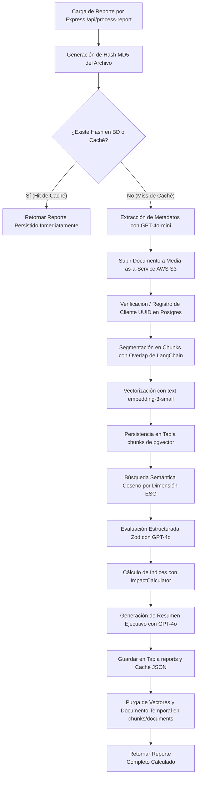
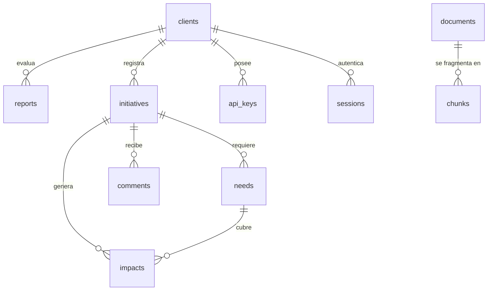

# Documentación IaaS

Este repositorio contiene toda la documentación del proyecto unificada en un solo archivo Markdown.

## Índice
1. [Endpoints de la API](#1-endpoints-de-la-api)
2. [Documentación Técnica de la API (Word)](#2-documentación-técnica-de-la-api)
3. [Lineamientos del Developer Portal (Word)](#3-lineamientos-del-developer-portal)
4. [Resumen de Migración a Express (Word)](#4-resumen-de-migración-a-express)
5. [Documentación Técnica del Backend (motor_IaaS)](#5-documentación-técnica-del-backend-motor_iaas)
6. [Especificación OpenAPI completa (JSON)](#6-especificación-openapi-completa)
7. [Guía de Uso del Frontend (Markdown)](./Documentacion_Uso_Frontend.md)
8. [Guía de Uso del Motor (Markdown)](./Documentacion_Uso_Motor.md)

---

## 1. Endpoints de la API


Esta es la guía de integración técnica para el backend de Impact as a Service (IaaS). Este documento detalla el contrato exacto para cada uno de los endpoints disponibles en el sistema, organizados por dominio funcional, e incluye las especificaciones introducidas durante las fases recientes de migración.

## Aspectos Globales de Autenticación
Salvo excepciones específicas (como webhooks externos), todos los endpoints requieren autenticación mediante un Autorizador de API Gateway (`IaaSAuthorizer`).
- **Cabecera Requerida:** `x-api-key: <TU_API_KEY>`
- **Base URL:** Todas las rutas expuestas en este documento se asumen bajo un endpoint base, representado como `<BASE_URL>`.

---

## Índice General
1. Autenticación (Original Auth)
2. Gestión de Clientes
3. Manejo de Iniciativas
4. Impactos y Metas
5. Métricas y Analítica (Fases 1 y 2)
6. Generación de Reportes (Fase 2)
7. Visualización Pública y Búsqueda (Fase 3)
8. Archivos, Notificaciones y Misceláneos

---

## 1. Autenticación (Original Auth)
Nueva arquitectura de inicio de sesión que reemplaza a AWS Cognito, delegando la identidad al proveedor Original Auth.

### 1.1 Iniciar Sesión de Autenticación
- **Ruta:** `GET /auth/generate_session`
- **Descripción:** Inicia el flujo de autenticación "Single Sign-On".
- **Comportamiento Esperado:** Genera un estado local temporal (`session_id` con estado `PENDING`) que el frontend debe usar para redirigir al proveedor de Original Auth.
- **Ejemplo cURL:**
  ```bash
  curl --location --request GET '<BASE_URL>/auth/generate_session'
  ```

### 1.2 Webhook de Validación (Callback)
- **Ruta:** `POST /auth/callback`
- **Descripción:** Endpoint interno consumido exclusivamente por los servidores de Original Auth de forma asíncrona cuando un usuario completa el login.
- **Comportamiento Esperado:** Valida la firma del proveedor usando una clave secreta interna (`secret_key`), marca la sesión como `VALIDATED` en la base de datos, y provee temporalmente (en el contexto de ejecución) los datos del usuario. De no existir cuenta bajo este correo en la tabla local de Clientes, procede a provisionar una cuenta nueva automáticamente.
- **Cuerpo de la Petición (Ejemplo):**
  ```json
  {
      "session_id": "uuid-sesion",
      "user_data": {
          "email": "usuario@ejemplo.com",
          "name": "Nombre Usuario"
      }
  }
  ```

### 1.3 Validación Final Frontend
- **Ruta:** `POST /auth/validate_session`
- **Descripción:** Confirma del lado del cliente que la sesión ha sido validada exitosamente por el proveedor.
- **Comportamiento Esperado:** Otorga la respuesta definitiva requerida por el frontend y emite una cookie HTTP-only segura conteniendo el token JWT para uso subsecuente.
- **Cuerpo de la Petición:**
  ```json
  {
      "session_id": "uuid-sesion"
  }
  ```
- **Ejemplo cURL:**
  ```bash
  curl --location --request POST '<BASE_URL>/auth/validate_session' \
  --header 'Content-Type: application/json' \
  --data-raw '{ "session_id": "uuid-sesion" }'
  ```

---

## 2. Gestión de Clientes
Endpoints destinados a la consulta y actualización de perfiles de organizaciones empresariales o donadores.

### 2.1 Obtener todos los Clientes
- **Ruta:** `GET /client`
- **Descripción:** Listado completo de clientes registrados en el sistema.
- **Ejemplo cURL:**
  ```bash
  curl --location --request GET '<BASE_URL>/client' \
  --header 'x-api-key: <TU_API_KEY>'
  ```

### 2.2 Consultar Perfil Privado
- **Ruta:** `GET /client/{client_id}`
- **Descripción:** Obtiene los datos demográficos y configuraciones internas del cliente proporcionado.
- **Ejemplo cURL:**
  ```bash
  curl --location '<BASE_URL>/client/{client_id}' \
  --header 'x-api-key: <TU_API_KEY>'
  ```

### 2.3 Perfil Público mediante Subruta (Slug)
- **Ruta:** `GET /clients/{slug}`
- **Descripción:** Realiza una búsqueda mediante la URL amigable (slug) del cliente para el renderizado público web (por ejemplo, misitio.com/empresas/mi-empresa).
- **Ejemplo cURL:**
  ```bash
  curl --location '<BASE_URL>/clients/mi-empresa' \
  --header 'x-api-key: <TU_API_KEY>'
  ```

### 2.4 Modificación del Perfil de Cliente
- **Rutas:** `PATCH /client` (Perfil General) | `PATCH /updateClientSM` (Redes Sociales Exclusivas)
- **Descripción:** Actualiza de modo parcial o total la información o enlaces sociales del cliente autenticado.
- **Cuerpo de la Petición (`PATCH /client`):**
  ```json
  {
      "client_id": "id-del-cliente",
      "name": "Títulos y Nombres",
      "description": "Explicación biográfica o corporativa"
  }
  ```
- **Ejemplo cURL:**
  ```bash
  curl --location --request PATCH '<BASE_URL>/client' \
  --header 'x-api-key: <TU_API_KEY>' \
  --header 'Content-Type: application/json' \
  --data-raw '{
      "client_id": "123",
      "name": "Corporación XYZ"
  }'
  ```

---

## 3. Manejo de Iniciativas
Endpoints encargados del registro y modificación de las campañas y proyectos sociales expuestos a los agentes inversores.

### 3.1 Obtener y Filtrar Iniciativas Activas
- **Ruta:** `GET /initiatives`
- **Descripción:** Devuelve un arreglo paginado de las iniciativas globales con filtros ejecutados en backend.
- **Parámetros GET (Query String):**
  - `search` (string): Búsqueda textual por coincidencia (case-insensitive) en el nombre de la iniciativa.
  - `category` (string): Busca exactitud literal por categoría de rubro.
  - `dateFrom`, `dateTo` (ISO Date): Rango temporal para filtrar `creation_date`.
  - `status` (string, separador por comas): Opciones soportadas son `completed`, `active`, `inProgress`, `recentAdded`, `topInitiatives`.
  - `page`, `limit` (número): Control de paginación de los registros.
- **Ejemplo cURL:**
  ```bash
  curl --location '<BASE_URL>/initiatives?status=active,completed&limit=20&page=1' \
  --header 'x-api-key: <TU_API_KEY>'
  ```

### 3.2 Listar Iniciativas Propias de un Cliente
- **Ruta:** `GET /initiativesofclient/{client_id}`
- **Descripción:** Implementa la misma lógica de los filtros de listado descritos anteriormente (3.1), pero limitando su resultado mediante una clave de búsqueda restrictiva (`client_id`).
- **Ejemplo cURL:**
  ```bash
  curl --location '<BASE_URL>/initiativesofclient/{client_id}?status=active' \
  --header 'x-api-key: <TU_API_KEY>'
  ```

### 3.3 Consultas Transaccionales Directas
Estas operaciones realizan búsquedas, mutaciones o borrados atómicos de entidades Iniciativa.
- **Leer Iniciativa Individual:** `GET /initiatives/{initiative_id}`
- **Modificar Metadatos:** `PATCH /initiatives` (El documento JSON de la solicitud requiere de `initiative_id` mandatoriamente en su primer nivel).
- **Borrado Lógico y Físico:** `DELETE /initiatives` (El documento de la solicitud requiere `initiative_id`).
- **Listar el Árbol de Categorías:** `GET /initiatives/getInitiativeCategoriesOfClient/{client_id}` (Devuelve solo las categorías exactas registradas exitosamente para este cliente, ordenadas de modo alfabético).

---

## 4. Impactos y Metas
Funcionalidad dedicada a medir métricas de consecución de aportes (Impacts) comparado contra los objetivos pre-solicitados (Needs).

### 4.1 Crear un Objetivo (Need/Goal)
- **Ruta:** `POST /initiatives/{initiative_id}/needs`
- **Descripción:** Añade un nuevo nivel de meta (sea monetaria, material, o técnica) vinculándolo a la campaña deseada.
- **Cuerpo de la Petición:**
  ```json
  {
      "type": "Economic",
      "amount": 50000,
      "description": "Meta mínima operativa"
  }
  ```
- **Ejemplo cURL:**
  ```bash
  curl --location --request POST '<BASE_URL>/initiatives/{initiative_id}/needs' \
  --header 'x-api-key: <TU_API_KEY>' \
  --header 'Content-Type: application/json' \
  --data-raw '{ "type": "Economic", "amount": 50000, "description": "Detalles" }'
  ```

### 4.2 Registrar una Contribución (Impact)
- **Ruta:** `POST /initiatives/{initiative_id}/impacts`
- **Descripción:** Formaliza el registro del impacto del lado de un usuario.
- **Cuerpo de la Petición:**
  ```json
  {
      "amount": "500",
      "type": "Social",
      "contributor_id": "id-del-contribuyente"
  }
  ```

### 4.3 Consultas Transaccionales Tradicionales
- **GET /impacts/{client_id}:** Lista un extracto crudo de todas las transacciones de un donador.
- **POST /impacts/totalgiven:** Retorna la métrica absoluta total de cuánto ha entregado en general un contribuyente al día de hoy.
- **POST /impacts/totalreceived:** Métrica global absoluta correspondiente a la captación neta de la ONG al día de hoy.
- **GET /needs/{need_id}:** Recuperación independiente del estado individual de cumplimiento de una meta.

---

## 5. Métricas y Analítica (Fases 1 y 2)
Endpoints de procesamiento avanzado desarrollados para anular y evitar el efecto de redundancia múltiple generada por las llamadas repetidas desde el navegador y reducir consultas secundarias sobre DynamoDB (N+1 queries).

### 5.1 Estado General e Inventario (Dashboard Empresarial)
- **Ruta:** `GET /clients/{client_id}/metrics/general`
- **Respuesta Esperada:**
  ```json
  {
      "totalInitiatives": 25,
      "activeInitiatives": 10,
      "completedInitiatives": 8,
      "pendingInitiatives": 7
  }
  ```
- **Ejemplo cURL:**
  ```bash
  curl --location '<BASE_URL>/clients/{client_id}/metrics/general' \
  --header 'x-api-key: <TU_API_KEY>'
  ```

### 5.2 Agregación de Series de Tiempo (Gráficos)
- **Ruta:** `GET /initiatives/{initiative_id}/impacts/aggregated`
- **Parámetros Requeridos:** `period` (Valores permitidos `weekly`, `monthly`, `yearly`). Variables de año (`year`) son opcionales y usarán el presente en caso de omitirse.
- **Respuesta Esperada:** Listas paralelas con la abscisa (labels) y ordenada (series). Ideal para inyección directa a componentes React Recharts o ApexCharts.

### 5.3 Proporciones de Distribución
- **Distribución de Categorías:** `GET /initiatives/{initiative_id}/impacts/by-type` (Entregando un objeto estandarizado y el tipo exacto agrupado como `Social` o `Economic`).
- **Estado de Objetivos Consolidado:** `GET /initiatives/{initiative_id}/goals/progress` (Computa la operación interna: `impacto_acumulado / monto_objetivo * 100`).

### 5.4 Consolidado de Métrica de Iniciativa Completa
- **Ruta:** `GET /initiatives/{initiative_id}/metrics/complete`
- **Descripción:** Resuelve los datos calculados e inyecta algoritmos para determinar la 'salud' del proyecto: progreso de fechas restantes (`daysRemaining`), diferencial de velocidad contra el inicio (`progressStatus`), así como su puntuación técnica (`efficiencyRating`). Múltiples requerimientos paralelos resueltos por una instancia única de Lambda.

### 5.5 Analíticas Auxiliares
- **Actividad de Impacto:** `GET /initiatives/{initiative_id}/activity?period=week` (Transacciones recientes de los últimos siete o treinta días).
- **Métricas Retrospectivas del Cliente:** `GET /clients/{client_id}/impacts/stats?days=60`
- **Tabla de Contribuyentes Clasificados:** `GET /initiatives/{initiative_id}/contributors/detailed?limit=5` (Entrega las identidades asignadas a niveles jerárquicos monetario o por recurrencia).

---

## 6. Generación de Reportes (Fase 2)
Endpoints asíncronos orientados a auditar documentos, reportes PDF e imprimir memorias sobre campañas de modo sistemático.

### 6.1 Estadísticas Concatenadas (Múltiples Campañas)
- **Ruta:** `POST /reports/stats`
- **Cuerpo de la Petición:**
  ```json
  {
      "initiative_ids": ["init1", "init2", "init3"]
  }
  ```
- **Respuesta Esperada:** Devolverá un bloque de total consolidado de resumen (summary) y métricas segmentadas del tipo (types), para cada iniciativa solicitada.

### 6.2 Desencadenar la Impresión a Archivo S3 (Reporte Formal)
- **Ruta:** `POST /generateInitiativeReport`
- **Descripción:** Lanza la función asíncrona dedicada que compila las métricas del proyecto y las exporta a un documento PDF.
- **Cuerpo de la Petición:**
  ```json
  {
      "initiative_id": "id-iniciativa",
      "client_id": "id-del-cliente"
  }
  ```
- **Ejemplo cURL:**
  ```bash
  curl --location --request POST '<BASE_URL>/generateInitiativeReport' \
  --header 'x-api-key: <TU_API_KEY>' \
  --header 'Content-Type: application/json' \
  --data-raw '{ ... }'
  ```

---

## 7. Visualización Pública y Búsqueda (Fase 3)
Funciones estandarizadas para el ambiente web público sin credenciales explícitas preexistentes pero optimizadas al milisegundo de respuesta.

### 7.1 Panel Transparente Público de Relación de Proyectos
- **Ruta:** `GET /users/{user_id}/initiatives/participated?limit=10`
- **Descripción:** Lista y analiza automáticamente los historiales relacionales del usuario con la causa respectiva; devolviendo el historial consolidado con indicadores de desempeño alfabéticos (trend: `"up"` | `"down"`).

### 7.2 Uso Consolidado de Panel de Donante Público
- **Ruta:** `GET /users/{user_id}/public-profile/stats`
- **Descripción:** Retorna el uso del último mes y el histórico del año por semanas aplicables para un donador expuesto, de modo completamente empaquetado y resuelto.

### 7.3 Búsqueda Global Agrupada (Unified Search)
- **Ruta:** `GET /search`
- **Parámetros Requeridos:** `q=` (Texto)
- **Parámetros Opcionales:** `type=` (`all` por defecto, pudiendo restringirse explícitamente a `clients` o a `initiatives`). El límite general está delimitado a diez elementos por cada respuesta particular.
- **Respuesta Esperada:**
  ```json
  {
      "clients": [ { "id": "...", "name": "..." } ],
      "initiatives": [ { "id": "...", "name": "..." } ],
      "totalResults": 2
  }
  ```

---

## 8. Archivos, Notificaciones y Misceláneos

### 8.1 Gestión y Carga de Imágenes (Almacenamiento Local / S3 Fallback)
El sistema soporta almacenamiento desacoplado de AWS. Si se configura `STORAGE_TYPE=local`, los archivos se guardan y sirven localmente desde el servidor Express (carpeta `/uploads`). En caso contrario, se realiza la subida a buckets de AWS S3 mediante URLs firmadas (Presigned URLs).
- **Solicitar el Punto Restringido de Subida:** `POST /presignedGalleryUrls`
  - **Body:** `{"bucket": "galleries", "filenames": ["archivo-1.jpg"]}`
- **Lectura/Acceso de Imágenes:** `GET /showGalleryImage?key=archivo-1.jpg`

### 8.2 Actualización Paramétrica de Avatares (Imagen)
- **`POST /imageUpload`**: Almacenamiento base perfil.
- **`POST /updateProfileImage`** y su réplica **`POST /client/{client_id}/updateProfileImageUrl`**: Para confirmación asíncrona post carga.
- **`POST /updateInitiativeImageUrl`**: Referencia atómica de avatar primario de iniciativa.

### 8.3 Correos Transaccionales (SMTP / SES Fallback) y Comentarios
- **Foro en Plataforma (Comentarios):**
  - **Lectura de Foro:** `GET /comments?initiative_id=123`
  - **Envío Formal de Comentario al Servidor:** `POST /comments`
- **Servicio Interno de Notificaciones y Soporte por Correo:**
  Si se configuran las variables SMTP (`SMTP_HOST`, `SMTP_PORT`, etc.), los correos se envían usando SMTP estándar (Nodemailer). De lo contrario, se realiza un fallback a AWS SES si las credenciales de AWS están presentes.
  - **Hito Social Logrado (Notificación):** `POST /notify-update`
  - **Ticket Administrativo de Soporte:** `POST /notify-support`


---

## 2. Documentación Técnica de la API

__CATÁLOGO TÉCNICO Y RUTAS DE NAVEGACIÓN__

__Endpoints y Rutas: API, Motor y Frontend  
Sistema IAAS__

# 1\. Endpoints de la API REST \(API\_IaaS\)

A continuación se detallan todos los endpoints expuestos por la API REST principal, la cual sirve como núcleo de datos PostgreSQL y lógica de negocio para la plataforma\.

- __\[GET\] /auth/generate\_session : __Generar una sesión de inicio temporal para Original Auth* \(Auth\)*
- __\[POST\] /auth/callback : __Webhook de Original Auth para validar la sesión y crear cliente* \(Auth\)*
- __\[POST\] /auth/validate\_session : __Validar la sesión y emitir JWT seguro en Cookies* \(Auth\)*
- __\[GET\] /helloapi : __Ping para validar el estado de la API* \(System\)*
- __\[POST\] /client : __Registrar un nuevo cliente en el sistema* \(Clients\)*
- __\[GET\] /client : __Obtener el listado de todos los clientes* \(Clients\)*
- __\[PATCH\] /client : __Actualizar información parcial del cliente* \(Clients\)*
- __\[GET\] /client/\{client\_id\} : __Obtener información de un cliente por su ID* \(Clients\)*
- __\[DELETE\] /client/\{client\_id\} : __Eliminar de forma permanente un cliente y sus datos* \(Clients\)*
- __\[GET\] /clients/\{slug\} : __Obtener datos del cliente a través de su slug único de URL* \(Clients\)*
- __\[PATCH\] /updateClientSM : __Actualizar exclusivamente las redes sociales de un cliente* \(Clients\)*
- __\[GET\] /clients/\{client\_id\}/needs : __Obtener las necesidades o metas de un cliente* \(Clients\)*
- __\[POST\] /initiatives : __Crear una nueva iniciativa social o ambiental* \(Initiatives\)*
- __\[GET\] /initiatives : __Obtener todas las iniciativas registradas* \(Initiatives\)*
- __\[GET\] /initiatives/\{initiative\_id\} : __Obtener una iniciativa por su ID* \(Initiatives\)*
- __\[DELETE\] /initiatives : __Eliminar una iniciativa indicando su ID en query string* \(Initiatives\)*
- __\[GET\] /initiativesofclient/\{client\_id\} : __Obtener las iniciativas de un cliente específico* \(Initiatives\)*
- __\[PATCH\] /initiatives : __Actualizar información de una iniciativa* \(Initiatives\)*
- __\[GET\] /initiatives/getInitiativeCategoriesOfClient/\{client\_id\} : __Categorías de iniciativas de un cliente con sus impactos* \(Initiatives\)*
- __\[GET\] /initiatives/Contributors/\{initiative\_id\} : __Obtener la lista de donadores únicos de una iniciativa* \(Initiatives\)*
- __\[POST\] /initiatives/\{initiative\_id\}/impacts : __Agregar una aportación de impacto a una iniciativa* \(Impacts\)*
- __\[GET\] /initiatives/\{initiative\_id\}/impacts : __Obtener impactos asociados a una iniciativa* \(Impacts\)*
- __\[GET\] /impacts/\{client\_id\} : __Obtener impactos asociados a un cliente* \(Impacts\)*
- __\[POST\] /impacts : __Consultar impactos por iniciativa y rango de fechas* \(Impacts\)*
- __\[POST\] /impacts/totalgiven : __Obtener el total de impacto aportado por un donador* \(Impacts\)*
- __\[POST\] /impacts/totalreceived : __Obtener el total de impacto recibido por un cliente* \(Impacts\)*
- __\[GET\] /impacts/Participations/\{need\_id\} : __Obtener participaciones de impacto vinculadas a una meta/necesidad* \(Impacts\)*
- __\[GET\] /initiatives/\{initiative\_id\}/activity : __Actividad de impactos por periodos \(semana/mes/año\)* \(Impacts\)*
- __\[GET\] /initiatives/\{initiative\_id\}/contributors/detailed : __Listado detallado de contribuidores con información de perfil* \(Impacts\)*
- __\[POST\] /initiatives/\{initiative\_id\}/metrics : __Registrar un nuevo indicador de métrica para la iniciativa* \(Metrics\)*
- __\[GET\] /initiatives/\{initiative\_id\}/metrics : __Obtener las métricas de una iniciativa* \(Metrics\)*
- __\[GET\] /clients/\{client\_id\}/metrics/general : __Métricas generales \(iniciativas totales, activas, completadas\)* \(Metrics\)*
- __\[GET\] /initiatives/\{initiative\_id\}/metrics/complete : __Métricas consolidadas \(burndown chart, velocidad, eficiencia\)* \(Metrics\)*
- __\[GET\] /initiatives/\{initiative\_id\}/goals/progress : __Progreso de metas de la iniciativa* \(Metrics\)*
- __\[POST\] /imageUpload : __Subir una imagen base64 \(Foto de perfil\)* \(Images\)*
- __\[POST\] /updateProfileImage : __Actualizar la URL de la imagen de perfil de un cliente* \(Images\)*
- __\[POST\] /updateInitiativeImageUrl : __Actualizar la imagen principal de una iniciativa* \(Images\)*
- __\[POST\] /presignedGalleryUrls : __Generar URLs firmadas para subir múltiples archivos a la galería S3* \(Images\)*
- __\[GET\] /showGalleryImage : __Listar imágenes de la galería asociadas a una entidad* \(Images\)*
- __\[POST\] /reports/stats : __Obtener estadísticas agregadas para generación de reportes* \(Reports\)*
- __\[GET\] /clients/\{client\_id\}/esg\-reports : __Obtener reportes ESG y de ImpactIndex del cliente* \(Reports\)*
- __\[POST\] /comments : __Registrar un comentario en una iniciativa* \(Comments\)*
- __\[GET\] /comments : __Obtener comentarios ordenados descendentemente por fecha* \(Comments\)*

# 2\. Endpoints del Motor de Evaluación \(motor\_IaaS\)

A continuación se listan los endpoints del Motor RAG y Evaluación de Reportes, el cual lee y procesa los documentos ESG en formato PDF y calcula el ImpactIndex mediante LLMs\.

- __\[GET\] /api/reports : __Obtener la lista de todos los reportes ESG y dimensiones calculadas
- __\[GET\] /api/ranking : __Obtener el ranking global de reportes calculados \(ImpactIndex, AlternativeIndex\)
- __\[GET\] /api/report/:slug : __Obtener la estructura de evaluación de un reporte filtrado por slug \(y opcional por año\)
- __\[POST\] /api/process\-report : __Subir y procesar archivos PDF, extraer textos corporativos y calcular puntuaciones ESG
- __\[DELETE\] /api/report/:slug : __Eliminar un reporte evaluado por su slug \(y opcionalmente por año\)

# 3\. Rutas de Navegación Frontend \(front\-v2\)

Rutas del enrutador de cliente \(React Router DOM\) en el Frontend que definen las vistas y páginas del portal del cliente\.

- __/landing/\* : __Página pública de bienvenida \(Home\)
- __/auth/signin : __Formulario de inicio de sesión de usuario
- __/auth/logout : __Acción de cierre de sesión y destrucción de sesión de usuario
- __/auth/return : __Ruta de retorno desde Original Auth para procesar la respuesta
- __/auth/error : __Página de visualización de errores durante el login
- __/auth/complete\-profile : __Página para complementar información de nuevos usuarios
- __/admin/dashboard : __Panel de control principal \(Dashboard general de métricas\)
- __/admin/initiatives : __Panel de visualización y lista de iniciativas
- __/admin/newinitiative : __Formulario de creación de una nueva iniciativa de desarrollo
- __/admin/metrics : __Vista general de métricas acumuladas del proyecto
- __/admin/reports : __Sección de reportes ESG cargados, evaluación y exportación en PDF
- __/admin/needs : __Panel de administración y estado de necesidades/metas
- __/admin/newneed : __Formulario de registro de una meta/necesidad
- __/admin/profile : __Vista detallada del perfil corporativo de la organización
- __/admin/edit\-profile : __Edición de datos de perfil y redes sociales de la empresa
- __/admin/my\-initiative/:id : __Panel interactivo con la ficha detallada de una iniciativa específica
- __/admin/search : __Búsqueda y visualización global de clientes e iniciativas


---

## 3. Lineamientos del Developer Portal

__COMUNICADO OFICIAL__

__Lineamientos de Developer Portals e Integración de OpenAPI  
Sistema IAAS__

__DE:__

Líder de Integración y Plataforma Docs \(Sistema IAAS\)

__PARA:__

Líderes de Proyecto y Equipos de Desarrollo de Backend/Frontend

__FECHA:__

19 de June de 2026

__ASUNTO:__

Especificaciones y requerimientos para la publicación de Developer Portals

# __1\. Contexto e Implementación__

Por medio del presente comunicado se comparten los lineamientos y especificaciones técnicas para la creación y publicación de los Developer Portals correspondientes a los proyectos bajo el ecosistema IAAS\.

*Nota del proyecto:  
La implementación técnica de cada portal es ágil y directa\. No obstante, el esfuerzo principal requerido por parte de los equipos de desarrollo radica en complementar la documentación existente con información funcional detallada, descripciones explicativas y ejemplos claros para cada uno de los endpoints que se integren\.*

# __2\. Clasificación de Documentación Requerida__

Para garantizar un estándar óptimo y ordenado de la documentación expuesta, los equipos deberán separar el contenido según los siguientes lineamientos oficiales:

__Documentación Interna  
\(Obligatoria para todos los proyectos\)__

__Documentación Orientada a Usuarios  
\(Opcional\)__

__Objetivo: Uso exclusivo para administración y desarrollo interno\.__

- Debe incluir todos los endpoints del backend, sin excepciones\.
- Detallar minuciosamente parámetros, esquemas de respuesta, permisos y esquemas de base de datos\.
- Responder con precisión: ¿Qué hace el endpoint? y ¿Para qué se usa?
- Proporcionar ejemplos reales y funcionales de llamadas y retornos\.
- Restringir el acceso estrictamente a usuarios internos autorizados, alojándose de forma segura e interna en el proyecto\.

__Objetivo: Documentación apta para exposición pública o de clientes\.__

- Aplica solo para proyectos que requieran exponer APIs públicamente o a terceros\.
- Incluir únicamente endpoints de consulta y operaciones seguras para el usuario final\.
- Excluir explícitamente endpoints administrativos, críticos, destructivos o que comprometan la seguridad del sistema\.
- Controlar el acceso \(público o restringido\) según las necesidades de negocio del proyecto, situándose en una ruta controlada\.

# __3\. Proceso de Integración a la Plataforma Docs__

Para realizar la integración del portal, los líderes y desarrolladores deben seguir estos pasos:

__1\. Publicación de OpenAPI: __Asegurar que el proyecto exponga de manera pública o privada el archivo JSON correspondiente bajo el estándar OpenAPI, comúnmente denominado openapi\.json\.

__2\. Envío de la URL: __Una vez finalizada y enriquecida la especificación, los equipos de desarrollo deberán proveer la URL directa del archivo openapi\.json\.

__3\. Consolidación en Docs: __La plataforma central de Docs utilizará dicho archivo para integrarlo dinámicamente y gestionar la visibilidad de los endpoints según el tipo de documentación \(interna o usuario\)\.

# __4\. Canales de Soporte y Dudas__

*Soporte y Consultas:  
Si los equipos técnicos requieren apoyo o surgen dudas sobre los presentes requerimientos, se solicita utilizar los canales habituales de comunicación \(chat oficial del proyecto\)\. De ser necesario, se puede coordinar y agendar una sesión grupal de alineación técnica\.*


---

## 4. Resumen de Migración a Express

__Reporte de Migración de AWS a Express\.js__

*Resumen Ejecutivo de Cambios y Verificación \(Fase 1 y Fase 2\) — API\_IaaS*

Este documento detalla la migración de la API de Impact Index \(API\_IaaS\) desde la arquitectura original en AWS Lambda \(Serverless Framework\) hacia un servidor continuo e independiente basado en Express\.js\. El objetivo principal es permitir la ejecución local y su contenedorización para despliegue en Easypanel, eliminando por completo la dependencia obligatoria de la infraestructura de AWS\.

__1\. Objetivos del Cambio__

- Migrar la arquitectura de ejecución de Lambdas Serverless a un servidor Express\.js estándar\.
- Desacoplar los servicios propietarios de AWS \(S3 para imágenes, SES para correos, Secrets Manager para llaves criptográficas\)\.
- Implementar un 'Modo Dual' que priorice el almacenamiento y correo locales \(disco/SMTP\) con fallbacks automáticos a AWS si se configuran\.
- Garantizar el 100% de compatibilidad con las pruebas unitarias y de integración existentes en el proyecto\.

__2\. Cambios Implementados__

__Servidor de Express \(server\.ts & expressAdapter\.ts\): __Creado el archivo del servidor Express que mapea las más de 60 rutas del backend\. Se implementó un adaptador 'lambdaAdapter' que encapsula los handlers originales, evitando tener que reescribir la lógica de negocio\. También se implementó 'expressAuthMiddleware' para replicar la autenticación JWT y API Keys de AWS API Gateway\.

__Envío de Correo Independiente \(mailer\.ts\): __Creada una utilidad de correo basada en Nodemailer\. Si se configura SMTP\_HOST en el entorno, los correos se envían usando SMTP estándar\. En caso contrario, se realiza un fallback automático a AWS SES\.

__Almacenamiento Local de Archivos \(storage\.ts\): __Reemplazado el SDK directo de S3 por una utilidad de almacenamiento\. En modo local \(STORAGE\_TYPE=local\), los reportes e imágenes se guardan y leen del disco local \(carpeta /uploads\)\. Se crearon endpoints en Express para simular la subida directa de archivos \(PUT /upload\-local/:client\_id/:filename\) y servir estáticos de forma transparente\.

__Llaves Criptográficas sin AWS Secrets Manager: __Modificada la lógica de descifrado en cryptoUtils\.ts e IaaSAuthorizer\.ts para leer directamente 'AES\_SECRET\_KEY' desde las variables de entorno, evitando peticiones HTTPS externas a AWS\.

__Dockerización del Servidor \(Dockerfile\): __Creado un Dockerfile multi\-etapa optimizado que compila TypeScript y expone el servidor Express en el puerto 3005 para su fácil despliegue en Easypanel\.

__3\. Resultados de Pruebas y Verificación__

- Pruebas Unitarias Exitosas: Ejecutadas las 10 suites de pruebas \(74 pruebas individuales\) y todas pasaron satisfactoriamente \(100% OK\), incluyendo las suites modificadas de desacoplamiento de AWS\.
- Prueba de Integración Local Completa: Utilizando una base de datos de desarrollo \(Supabase\) y el almacenamiento local configurado, el script 'test\-api\-local\.js' validó satisfactoriamente todo el flujo:  
   a\) Lectura y escritura de clientes en base de datos PostgreSQL\.  
   b\) Subida base64 de imagen de perfil al servidor local\.  
   c\) Acceso estático y descarga de la imagen desde el servidor \(/uploads\)\.  
   d\) Generación de firmas de subida de galería y carga PUT binaria al servidor\.  
   e\) Listado correcto de imágenes en la galería local\.

__4\. Configuración Requerida en Easypanel \(Variables de Entorno\)__

__DATABASE\_URL: __Cadena de conexión de PostgreSQL en Easypanel\.

__STORAGE\_TYPE: __Configurar como 'local' para usar almacenamiento en disco\.

__AES\_SECRET\_KEY: __Clave de 32 caracteres para el descifrado heredado \(Legacy\) de API Keys\.

__profileImageBucket: __Configurar como 'bucket\-profile\-images\-iaas'\.

__PORT: __Puerto para escuchar peticiones en el contenedor \(por defecto 3005\)\.

__SMTP\_HOST, SMTP\_PORT, SMTP\_USER, SMTP\_PASS: __Credenciales de correo electrónico SMTP \(opcional, reemplaza a AWS SES\)\.


---

## 5. Documentación Técnica del Backend (motor_IaaS)

Esta documentación proporciona un análisis técnico profundo del diseño de software, arquitectura de datos, flujos de procesamiento RAG, el motor de inteligencia artificial y los algoritmos matemáticos implementados en el repositorio `motor_IaaS` (ImpactoSocial).

---

### 5.1 Arquitectura y Stack Tecnológico

El backend está estructurado como una API REST robusta optimizada para operaciones intensivas de análisis de datos no estructurados mediante Inteligencia Artificial y bases de datos vectoriales.

*   **Entorno de Ejecución:** Node.js v20+ con soporte nativo de **TypeScript** mediante Express.js.
*   **Base de Datos Relacional y Vectorial:** PostgreSQL enriquecido con la extensión **pgvector** para el soporte de operaciones geométricas en espacios vectoriales (búsqueda de vecinos más cercanos mediante similitud coseno).
*   **Capa de Persistencia:** Drizzle ORM que garantiza tipado estático seguro y sincronización ágil de migraciones mediante `drizzle-kit`.
*   **Orquestación de IA y RAG:** Integración directa con los modelos de lenguaje de OpenAI (`gpt-4o` y `gpt-4o-mini`) y uso de embeddings semánticos (`text-embedding-3-small` de 1536 dimensiones) orquestados mediante LangChain.
*   **Procesamiento de Documentos:** Ingesta multiformato mediante `pdf-parse`, `officeparser`, `mammoth` y fallback con `any-text`.
*   **Almacenamiento en la Nube:** Integración mediante peticiones firmadas (HMAC SHA-256) con el servicio externo **Media-as-a-Service (MediaAAS)** para la persistencia física de reportes y metadatos en depósitos de AWS S3.

---

### 5.2 Diagrama de Flujo del Pipeline Ingesta-RAG-Evaluación

El siguiente diagrama detalla cómo se procesa un reporte corporativo desde su subida hasta la persistencia de las métricas ESG calculadas y la posterior purga de vectores temporales para garantizar la soberanía de los datos:



---

### 5.3 Modelo de Datos (Drizzle Schema)

La base de datos se modela bajo una arquitectura híbrida relacional/vectorial que sirve tanto a la lógica transaccional de la API de IaaS (donaciones, iniciativas, clientes) como al motor analítico de reportes ESG.



#### Detalle de las Tablas Principales

*   `documents`: Almacena el texto crudo unificado de los archivos subidos para auditoría rápida.
*   `chunks`: Fragmentos de texto generados para la búsqueda semántica. Incluye la columna `embedding` mapeada con el tipo personalizado `vector(1536)` de pgvector.
*   `reports`: Almacena los resultados consolidados de las auditorías ESG. El campo `report_data` es de tipo `JSONB` y guarda la estructura completa de calificaciones y evidencias. Posee una restricción única compuesta (`slug_year_idx`) para evitar duplicidad de reportes de una organización en el mismo periodo anual.
*   `clients`: Registro maestro de las organizaciones clientes de IaaS.
*   `initiatives`: Proyectos e iniciativas comunitarias de impacto impulsadas por un cliente.
*   `needs`: Necesidades operativas de insumos o recursos financieros vinculados a una iniciativa.
*   `impacts`: Donaciones o contribuciones directas recibidas por donantes para subsanar necesidades.
*   `comments`: Muro social e interactivo de retroalimentación en iniciativas.
*   `sessions`: Tokens y estados de autenticación mediante el webhook original.
*   `api_keys`: Credenciales API que autorizan el consumo del motor y del ecosistema.

---

### 5.4 Pipeline de Ingesta y Vectorización

El endpoint `/api/process-report` procesa los archivos mediante los siguientes pasos técnicos:

1.  **Detección de Extensiones:** Valida la estructura mediante extensiones de archivo permitidas (`.pdf`, `.docx`, `.doc`, `.txt`, `.md`, `.xlsx`, `.xls`, `.pptx`, `.ppt`).
2.  **Seguridad y Deduplicación Dinámica:** Calcula el hash MD5 de los binarios para verificar si el archivo ya fue evaluado, sirviendo los datos desde caché si se encuentra una coincidencia.
3.  **Extracción de Identidad Corporativa (GPT-4o-mini):** Mediante análisis semántico de los primeros 3000 caracteres, identifica:
    *   Nombre oficial de la organización.
    *   Año explícito del reporte (`reportYear`).
    *   Paleta de color corporativo (`primaryColor`).
    *   Dominio institucional.
4.  **Almacenamiento Persistente en MediaAAS:** Transmite el búfer binario a AWS S3 a través de MediaAAS mediante autenticación HMAC SHA-256.
5.  **Chunking Textual:** Divide el texto completo en fragmentos lógicos mediante el `RecursiveCharacterTextSplitter` con un `chunkSize` de `2500` caracteres y un `chunkOverlap` de `300` caracteres para asegurar la continuidad del contexto.
6.  **Indexación Vectorial y Purgado:** Los fragmentos se convierten en vectores en `VectorStore` usando `text-embedding-3-small`. Una vez completado el flujo de consultas RAG de la evaluación, todos los vectores correspondientes al documento se **eliminan físicamente** de la base de datos para proteger la privacidad e integridad intelectual de la documentación del cliente, manteniendo solo el resultado agregado en `reports`.

---

### 5.5 El Motor RAG y Framework de Evaluación LLM

El motor evalúa a la organización sobre siete dimensiones estratégicas basadas en la taxonomía de **impacto.social**:

1.  **Social:** Iniciativas Comunitarias y Bienestar Humano.
2.  **Ambiental:** Sostenibilidad, Reforestación y Protección Ecológica.
3.  **Cultural:** Preservación Artística, Histórica y Cultural.
4.  **Performance:** Adquisición de Usuarios y Donaciones Activas.
5.  **Colaboración:** Participación Sectorial de Personas, Empresas u ONGs.
6.  **Económico:** Impacto Económico y Desarrollo Financiero.
7.  **Gobernanza:** Gobernanza Corporativa, Transparencia y Ética.

#### Búsqueda Semántica Coseno (pgvector)
Para cada una de las 7 dimensiones, el motor realiza una búsqueda de vecindad semántica (`similaritySearch`) en la tabla `chunks` limitando la recuperación a los **8 fragmentos** con menor distancia angular (mayor similitud). El operador utilizado en SQL a través de Drizzle es:

```sql
SELECT id, content, (1 - (chunks.embedding <=> [queryVector]::vector)) AS similarity
FROM chunks
WHERE document_id = docId
ORDER BY chunks.embedding <=> [queryVector]::vector
LIMIT 8;
```

Los fragmentos resultantes son ordenados cronológicamente por su `id` (manteniendo el hilo de lectura del reporte original) y se inyectan en el prompt del evaluador LLM.

#### Evaluación Estructurada (OpenAI Structured Outputs)
El backend utiliza la funcionalidad de **Structured Outputs** de OpenAI forzando al modelo a validar y estructurar su respuesta conforme al esquema Zod `EvaluationResultSchema`. 

```typescript
const EvaluationResultSchema = z.object({
  evaluations: z.array(z.object({
    metricName: z.string(),
    dimension: z.enum(['social', 'ambiental', 'cultural', 'economico', 'gobernanza', 'performance', 'colaboracion', 'otro']),
    materialidad: z.enum(['critico', 'alto', 'medio', 'bajo']),
    calidadEvidencia: z.array(z.enum(['fuente_identificable', 'fecha_definida', 'unidad_clara', 'metodologia_descrita'])),
    desempeno: z.enum(['supera_meta', 'cumple_meta', 'mejora', 'sin_cambio', 'empeora']),
    contribucion: z.enum(['directa', 'alta_influencia', 'indirecta', 'no_atribuible']),
    alcance: z.object({
      impactados: z.number().nullable(),
      totalRelevante: z.number().nullable()
    }),
    profundidad: z.enum(['transformacional', 'alto', 'medio', 'bajo']),
    duracion: z.enum(['permanente', 'largo_plazo', 'medio_plazo', 'puntual']),
    riesgo: z.enum(['muy_bajo', 'bajo', 'medio', 'alto', 'muy_alto']),
    estandaresAsociados: z.array(z.string()),
    reasoning: z.string(), // Texto narrativo estructurado (Análisis, Evidencia y Conclusión)
    citaOriginal: z.string(),
    evidenceIds: z.array(z.number()) // Índices del bloque RAG inyectado
  }))
});
```

*   **Regla Antifraude:** La IA tiene estrictamente prohibido realizar cálculos matemáticos agregados de puntuación finales ("La IA evalúa, el Backend calcula"). 
*   **Mapeo de Estándares:** Los estándares detectados por el LLM se contrastan y normalizan mediante la clase `NormativeMapper` contra un catálogo maestro validado (GRI, SASB, ODS) para mitigar falsas clasificaciones.

---

### 5.6 Algoritmo de Calificación Multidimensional (ImpactCalculator)

Una vez que el LLM genera los criterios cualitativos estructurados, la clase `ImpactCalculator` procesa las matrices de calificación cuantitativa:

#### Matrices de Calificación Base

```javascript
const SCORING_MATRICES = {
  materialidad: { critico: 100, alto: 80, medio: 55, bajo: 20 },
  desempeno:    { supera_meta: 100, cumple_meta: 80, mejora: 60, sin_cambio: 40, empeora: 15 },
  contribucion: { directa: 100, alta_influencia: 80, indirecta: 55, no_atribuible: 20 },
  profundidad:  { transformacional: 100, alto: 80, medio: 55, bajo: 20 },
  duracion:     { permanente: 100, largo_plazo: 80, medio_plazo: 55, puntual: 20 },
  riesgo:       { muy_bajo: 5, bajo: 20, medio: 45, alto: 70, muy_alto: 90 }
};

const EVIDENCE_SCORES = {
  fuente_identificable: 25,
  fecha_definida:       25,
  unidad_clara:         25,
  metodologia_descrita: 25
};
```

#### Fórmulas Matemáticas

##### 1. Calificación del Indicador (Level 1 Score)
Para cada métrica o indicador evaluado:

*   **Calidad de la Evidencia ($EQ_i$):** Suma directa de los atributos presentes de la evidencia.
    $$EQ_i = \sum \text{EVIDENCE\_SCORES[attr]} \quad (\text{Max } 100)$$

*   **Puntaje de Alcance ($A_i$):** Se calcula únicamente si existen datos numéricos explícitos.
    $$A_i = \begin{cases} 
      \min\left(\frac{\text{impactados}}{\text{totalRelevante}} \times 100, 100\right) & \text{si } \text{totalRelevante} > 0 \\ 
      \min(\text{impactados}, 100) & \text{si } \text{totalRelevante} \le 0 
    \end{cases}$$

*   **Base Positiva Bruta ($BP_i$):** El promedio ponderado de los componentes de valor positivo. Si el alcance está definido, el divisor es 6, de lo contrario es 5.
    $$BP_i = \frac{\text{desempeno} + \text{contribucion} + \text{profundidad} + \text{duracion} + EQ_i + (\text{alcance si aplica})}{Divisor}$$

*   **Penalización por Riesgo ($R_i$):** Se descuenta el puntaje de externalidades negativas latentes:
    $$\text{Multiplicador de Riesgo} = 1 - \frac{\text{riesgo}}{100}$$

*   **Puntaje de Nivel 1 Final ($S_{L1}$):**
    $$S_{L1} = BP_i \times \left(1 - \frac{\text{riesgo}}{100}\right)$$

##### 2. Calificación de la Dimensión (Level 2 Score)
El puntaje de cada una de las dimensiones de impacto ($S_{L2}$) es la media ponderada de sus indicadores ($S_{L1}$), utilizando el valor de **Materialidad** como factor de ponderación ($W_{mat}$):

$$S_{L2} = \frac{\sum (S_{L1} \times W_{mat})}{\sum W_{mat}}$$

##### 3. ImpactIndex Global
El índice principal que clasifica a las organizaciones es el promedio simple de las puntuaciones de las 7 dimensiones evaluadas:

$$\text{ImpactIndex} = \frac{\sum_{d=1}^{7} S_{L2, d}}{7}$$

##### 4. Sub-índices de Análisis (Analytics)
El motor genera 5 sub-índices clave para tableros analíticos y gráficos de radar:

*   **Impact Performance Score (IPS):** Mide el logro físico y la profundidad operativa:
    $$\text{IPS} = \frac{1}{N} \sum \left( \frac{\text{desempeno} + \text{profundidad}}{2} \times \left(\frac{A_i}{100} \text{ o } 1\right) \right)$$
*   **Impact Management Score (IMS):** Evalúa la planeación, materialidad y gobernanza del impacto:
    $$\text{IMS} = \frac{1}{N} \sum \left( \frac{\text{contribucion} + \text{materialidad}}{2} \right)$$
*   **Standards Coverage Score (SCS):** Nivel de adherencia formal de los indicadores a estándares globales (GRI, SASB, ODS):
    $$\text{SCS} = \frac{\text{Indicadores con estándares asociados}}{\text{Total de Indicadores}} \times 100$$
*   **Evidence Quality Score (EQS):** Grado de solidez de los datos presentados:
    $$\text{EQS} = \frac{1}{N} \sum EQ_i$$
*   **Net Impact Score (NIS):** Retorno de impacto neto tras deducir el promedio total de penalizaciones de riesgo:
    $$\text{NIS} = \max(0, \overline{BP} - \overline{Riesgo})$$

##### 5. AlternativeIndex
Un índice secundario ponderado diseñado para priorizar la distribución balanceada de las métricas de gestión:

$$\text{AlternativeIndex} = (0.30 \times \text{IPS}) + (0.20 \times \text{IMS}) + (0.15 \times \text{SCS}) + (0.15 \times \text{EQS}) + (0.20 \times \text{NIS})$$

---

### 5.7 Endpoints de la API REST

Todos los endpoints están prefijados bajo la ruta `/api`.

#### 1. Ingesta y Evaluación de Reportes
*   **Ruta:** `POST /process-report`
*   **Content-Type:** `multipart/form-data`
*   **Parámetros Body:**
    *   `documents`: Array de archivos (hasta 20 reportes PDF/Word/Texto simultáneos).
    *   `organizationName`: *(Opcional)* Nombre manual de la organización.
*   **Comportamiento:** Realiza la extracción de texto, vectorización, agrupamiento, análisis semántico multidimensional, cálculo de índices, guarda en la base de datos de Postgres y purga la base vectorial de forma segura.

#### 2. Obtener Lista de Evaluaciones
*   **Ruta:** `GET /reports`
*   **Respuesta:** Retorna metadatos generales de todos los reportes evaluados en el sistema (slug, nombre de organización, color corporativo, dominio, año de reporte, ImpactIndex consolidado y puntuaciones por dimensión).

#### 3. Obtener Detalle de Evaluación
*   **Ruta:** `GET /report/:slug`
*   **Query Params:** `?year=2023` *(Opcional)*
*   **Respuesta:** Payload JSON completo con el desglose por indicadores, resumen ejecutivo narrativo y referencias a archivos almacenados en MediaAAS.

#### 4. Tabla de Clasificación y Ranking
*   **Ruta:** `GET /ranking`
*   **Respuesta:** Listado ordenable optimizado para visualización de tablas comparativas de desempeño ESG basadas en `ImpactIndex` y `AlternativeIndex`.

#### 5. Eliminar Reporte
*   **Ruta:** `DELETE /report/:slug`
*   **Query Params:** `?year=2023` *(Opcional)*
*   **Comportamiento:** Elimina el registro físico de la base de datos de PostgreSQL y ejecuta llamadas asíncronas para eliminar los binarios correspondientes en AWS S3 mediante el servicio de MediaAAS.

---

### 5.8 Scripts de Soporte y Mantenimiento

*   **Purger de caché inmutable:**
    ```bash
    npm run clean:cache
    ```
    Elimina físicamente los archivos JSON consolidados almacenados en el directorio `pdf/cache/`, forzando al motor RAG a recalcular las evaluaciones de reportes en la próxima subida.
*   **Consola de Recálculo de Índices:**
    ```bash
    npx ts-node src/scripts/recalculate_alternative_index.ts
    ```
    Script diseñado para actualizar de forma masiva el `AlternativeIndex` de los reportes guardados en la base de datos cuando se modifican los coeficientes de ponderación algorítmica sin necesidad de re-evaluar con el LLM.
*   **Limpieza de Base de Datos:**
    ```bash
    npx ts-node clear_db.ts
    ```
    Limpia por completo las tablas `reports`, `chunks` y `documents`, dejando la base de datos en estado inicial.

---

## 6. Especificación OpenAPI completa

A continuación se muestra la especificación OpenAPI (Swagger) completa del backend en formato JSON.

<details>
<summary>🔍 Hacer clic aquí para expandir / contraer el JSON completo</summary>

```json
{
  "openapi": "3.0.3",
  "info": {
    "title": "API de ejemplo",
    "description": "API REST para gestionar iniciativas y clientes.\n",
    "version": "1.0.0",
    "contact": {
      "name": "Soporte",
      "email": "soporte@ejemplo.com"
    }
  },
  "servers": [
    {
      "url": "https://{{direccion_api}}/",
      "description": "Producción"
    },
    {
      "url": "http://localhost:3000",
      "description": "Desarrollo"
    }
  ],
  "security": [
    {
      "cognitoAuth": []
    }
  ],
  "components": {
    "securitySchemes": {
      "cognitoAuth": {
        "type": "http",
        "scheme": "bearer",
        "bearerFormat": "JWT",
        "description": "Autenticación con Amazon Cognito (Bearer token)"
      }
    },
    "schemas": {
      "Client": {
        "type": "object",
        "properties": {
          "client_id": {
            "type": "string",
            "description": "ID único del cliente",
            "example": "11787212-bf6a-4dbb-b0b7-fea6e8639c38"
          },
          "name": {
            "type": "string",
            "description": "Nombre del cliente",
            "example": "Usuario 8"
          },
          "type": {
            "type": "string",
            "description": "Tipo de cliente (Persona o Empresa)",
            "example": "Persona"
          },
          "email": {
            "type": "string",
            "format": "email",
            "description": "Correo electrónico del cliente",
            "example": "usuario6@gmail.com"
          },
          "phone": {
            "type": "string",
            "description": "Teléfono del cliente",
            "example": "8121525257"
          },
          "address": {
            "type": "string",
            "description": "Dirección del cliente",
            "example": "Calle ejemplo 7, 14555"
          },
          "description": {
            "type": "string",
            "description": "Descripción del cliente",
            "example": "Persona ejemplo 1"
          },
          "profile_image_url": {
            "type": "string",
            "description": "URL de la imagen de perfil",
            "example": ""
          },
          "creation_date": {
            "type": "string",
            "format": "date-time",
            "description": "Fecha de creación del cliente",
            "example": "Mon, 24 Mar 2025 14:14:38 GMT"
          },
          "social_media": {
            "type": "object",
            "description": "Redes sociales del cliente",
            "properties": {
              "facebook": {
                "type": "string",
                "description": "URL de Facebook",
                "example": ""
              },
              "X": {
                "type": "string",
                "description": "URL de X (anteriormente Twitter)",
                "example": ""
              },
              "instagram": {
                "type": "string",
                "description": "URL de Instagram",
                "example": ""
              },
              "tiktok": {
                "type": "string",
                "description": "URL de TikTok",
                "example": ""
              }
            }
          }
        }
      },
      "ClientListResponse": {
        "type": "object",
        "properties": {
          "status": {
            "type": "integer",
            "description": "Código de estado HTTP",
            "example": 200
          },
          "body": {
            "type": "array",
            "description": "Lista de clientes",
            "items": {
              "$ref": "#/components/schemas/Client"
            }
          }
        }
      },
      "ClientResponse": {
        "type": "object",
        "properties": {
          "status": {
            "type": "integer",
            "description": "Código de estado HTTP",
            "example": 200
          },
          "body": {
            "$ref": "#/components/schemas/Client"
          }
        }
      },
      "Need": {
        "type": "object",
        "properties": {
          "need_id": {
            "type": "string",
            "description": "ID único de la necesidad",
            "example": "abc123"
          },
          "client_id": {
            "type": "string",
            "description": "ID del cliente asociado",
            "example": "11787212-bf6a-4dbb-b0b7-fea6e8639c38"
          },
          "name": {
            "type": "string",
            "description": "Nombre de la necesidad",
            "example": "Agua potable"
          },
          "description": {
            "type": "string",
            "description": "Descripción detallada de la necesidad",
            "example": "Se necesita agua potable para 50 personas durante 3 días"
          },
          "quantity": {
            "type": "integer",
            "description": "Cantidad requerida",
            "example": 50
          },
          "unit": {
            "type": "string",
            "description": "Unidad de medida",
            "example": "litros"
          },
          "creation_date": {
            "type": "string",
            "format": "date-time",
            "description": "Fecha de creación",
            "example": "2025-03-24T14:00:00Z"
          }
        }
      },
      "ClientNeedsResponse": {
        "type": "object",
        "properties": {
          "status": {
            "type": "integer",
            "description": "Código de estado HTTP",
            "example": 200
          },
          "body": {
            "type": "array",
            "description": "Lista de necesidades asociadas al cliente",
            "items": {
              "$ref": "#/components/schemas/Need"
            }
          }
        }
      },
      "MetricInput": {
        "type": "object",
        "required": [
          "name",
          "unit"
        ],
        "properties": {
          "name": {
            "type": "string",
            "description": "Nombre de la métrica",
            "example": "CO2 reduction"
          },
          "unit": {
            "type": "string",
            "description": "Unidad de medida de la métrica",
            "example": "ppm"
          },
          "description": {
            "type": "string",
            "description": "Descripción detallada de la métrica",
            "example": "Cantidad de CO2 que absorben los pinos plantados"
          }
        }
      },
      "MetricResponse": {
        "type": "object",
        "properties": {
          "status": {
            "type": "integer",
            "example": 200
          },
          "body": {
            "type": "object",
            "properties": {
              "metric_id": {
                "type": "string",
                "format": "uuid",
                "example": "d7f5f5f3-af42-4a00-8105-5b7c5892c7bb"
              },
              "initiative_id": {
                "type": "string",
                "format": "uuid",
                "example": "60bcb98d-905c-4c9c-aa48-644d8eedccb9"
              },
              "name": {
                "type": "string",
                "example": "CO2 reduction"
              },
              "unit": {
                "type": "string",
                "example": "ppm"
              },
              "description": {
                "type": "string",
                "example": "Cantidad de CO2 que absorben los pinos plantados"
              }
            }
          }
        }
      },
      "ErrorResponse": {
        "type": "object",
        "properties": {
          "status": {
            "type": "integer",
            "example": 400
          },
          "message": {
            "type": "string",
            "example": "Error description"
          }
        }
      },
      "CommentInput": {
        "type": "object",
        "required": [
          "text",
          "initiative_id",
          "name"
        ],
        "properties": {
          "text": {
            "type": "string",
            "description": "Contenido del comentario",
            "example": "Máximo Ejemplo de comentario",
            "maxLength": 500
          },
          "initiative_id": {
            "type": "string",
            "format": "uuid",
            "description": "ID de la iniciativa asociada",
            "example": "c0817ca2-bb80-4b72-9b9a-1832163dca51"
          },
          "name": {
            "type": "string",
            "description": "Nombre del autor del comentario",
            "example": "Maximo 1",
            "maxLength": 100
          }
        }
      },
      "CommentResponse": {
        "type": "object",
        "properties": {
          "comment_id": {
            "type": "string",
            "format": "uuid",
            "example": "2bd68ec6-3221-4c08-a1c9-8d40c5450595"
          },
          "initiative_id": {
            "type": "string",
            "format": "uuid",
            "example": "c0817ca2-bb80-4b72-9b9a-1832163dca51"
          },
          "name": {
            "type": "string",
            "example": "Maximo 1"
          },
          "text": {
            "type": "string",
            "example": "Máximo Ejemplo de comentario"
          },
          "timestamp": {
            "type": "string",
            "format": "date-time",
            "example": "2025-03-25T17:11:42.333Z"
          }
        }
      }
    }
  },
  "paths": {
    "/client": {
      "post": {
        "summary": "Crear un nuevo cliente",
        "description": "Crea un cliente con la información proporcionada.",
        "tags": [
          "Clients"
        ],
        "security": [
          {
            "cognitoAuth": []
          }
        ],
        "requestBody": {
          "description": "Datos del cliente a crear",
          "required": true,
          "content": {
            "application/json": {
              "schema": {
                "$ref": "#/components/schemas/Client"
              },
              "example": {
                "name": "Usuario 8",
                "type": "Persona",
                "email": "usuario6@gmail.com",
                "phone": "8121525257",
                "address": "Calle ejemplo 7, 14555",
                "description": "Persona ejemplo 1"
              }
            }
          }
        },
        "responses": {
          "201": {
            "description": "Cliente creado exitosamente",
            "content": {
              "application/json": {
                "schema": {
                  "$ref": "#/components/schemas/Client"
                },
                "example": {
                  "client_id": "11787212-bf6a-4dbb-b0b7-fea6e8639c38",
                  "name": "Usuario 8",
                  "type": "Persona",
                  "email": "usuario6@gmail.com",
                  "phone": "8121525257",
                  "address": "Calle ejemplo 7, 14555",
                  "description": "Persona ejemplo 1",
                  "profile_image_url": "",
                  "creation_date": "Mon, 24 Mar 2025 14:14:38 GMT",
                  "social_media": {
                    "facebook": "",
                    "X": "",
                    "instagram": "",
                    "tiktok": ""
                  }
                }
              }
            }
          },
          "400": {
            "description": "Datos inválidos"
          },
          "401": {
            "description": "No autorizado"
          }
        }
      },
      "get": {
        "summary": "Obtener todos los clientes",
        "description": "Devuelve la lista de todos los clientes registrados.",
        "tags": [
          "Clients"
        ],
        "security": [
          {
            "cognitoAuth": []
          }
        ],
        "responses": {
          "200": {
            "description": "Lista de clientes obtenida con éxito",
            "content": {
              "application/json": {
                "schema": {
                  "$ref": "#/components/schemas/ClientListResponse"
                },
                "example": {
                  "status": 200,
                  "body": [
                    {
                      "client_id": "8c21106e-240b-4aec-96ab-07db5296d27f",
                      "name": "Usuario 3",
                      "type": "ONG",
                      "email": "usuario3@gmail.com",
                      "phone": "6182154891",
                      "address": "Calle ejemplo 3, 32555",
                      "description": "ONG ejemplo 2",
                      "profile_image_url": "",
                      "creation_date": "Mon, 10 Mar 2025 16:41:54 GMT",
                      "social_media": {
                        "facebook": "",
                        "X": "",
                        "instagram": "",
                        "tiktok": ""
                      }
                    },
                    {
                      "client_id": "08a4e268-1807-4fed-a3cf-ccd1c5e062ab",
                      "name": "Fernando Tellez Drouaillet",
                      "type": "Persona",
                      "email": "ftd121201@gmail.com",
                      "phone": "6182176686",
                      "address": "16 DE SEPTIEMBRE 121",
                      "description": "prueba foto",
                      "profile_image_url": "https://bucket-profile-images-iaas.s3-us-west-2.amazonaws.com/a89cd62c-cac0-4598-be35-f7ad51873092.jpg",
                      "creation_date": "Fri, 07 Mar 2025 19:35:17 GMT",
                      "social_media": {
                        "facebook": "",
                        "X": "",
                        "instagram": "",
                        "tiktok": ""
                      }
                    },
                    {
                      "client_id": "48b20bf8-1fa7-4291-b7fc-cb0ef629798a",
                      "name": "Usuario 5",
                      "type": "Empresa",
                      "email": "usuario5@gmail.com",
                      "phone": "8582154817",
                      "address": "Calle ejemplo 5, 14555",
                      "description": "Empresa ejemplo 2",
                      "profile_image_url": "",
                      "creation_date": "Mon, 10 Mar 2025 16:42:41 GMT",
                      "social_media": {
                        "facebook": "",
                        "X": "",
                        "instagram": "",
                        "tiktok": ""
                      }
                    }
                  ]
                }
              }
            }
          },
          "400": {
            "description": "Datos inválidos"
          },
          "401": {
            "description": "No autorizado"
          }
        }
      },
      "patch": {
        "summary": "Actualizar un cliente existente",
        "description": "Permite actualizar uno o varios campos de un cliente en la tabla `Clients`. Solo actualiza los campos que han cambiado. No sobrescribe campos con valores vacíos.",
        "tags": [
          "Clients"
        ],
        "requestBody": {
          "description": "Datos a actualizar del cliente.",
          "required": true,
          "content": {
            "application/json": {
              "schema": {
                "type": "object",
                "properties": {
                  "client_id": {
                    "type": "string",
                    "example": "62c93bcd-4632-4057-9456-90c67dd5f7a3",
                    "description": "ID único del cliente."
                  },
                  "name": {
                    "type": "string",
                    "example": "Máximo Josué CC",
                    "description": "Nombre del cliente."
                  },
                  "type": {
                    "type": "string",
                    "example": "aPersona",
                    "description": "Tipo del cliente."
                  },
                  "email": {
                    "type": "string",
                    "example": "correo@example.com",
                    "description": "Correo electrónico del cliente."
                  },
                  "phone": {
                    "type": "string",
                    "example": "6182584173",
                    "description": "Número de teléfono del cliente."
                  },
                  "address": {
                    "type": "string",
                    "example": "Calle de la modificación",
                    "description": "Dirección del cliente."
                  },
                  "description": {
                    "type": "string",
                    "example": "Pruebas de funcionalidad",
                    "description": "Descripción del cliente."
                  }
                }
              }
            }
          }
        },
        "responses": {
          "200": {
            "description": "Cliente actualizado con éxito o sin cambios detectados.",
            "content": {
              "application/json": {
                "examples": {
                  "ClienteActualizado": {
                    "value": {
                      "message": "Item updated",
                      "updatedItem": {
                        "client_id": "62c93bcd-4632-4057-9456-90c67dd5f7a3",
                        "name": "Máximo Josué CC",
                        "type": "aPersona",
                        "email": "correo@example.com",
                        "phone": "6182584173",
                        "address": "Calle de la modificación",
                        "description": "Pruebas de funcionalidad"
                      }
                    }
                  },
                  "SinCambios": {
                    "value": {
                      "message": "No changes detected"
                    }
                  }
                }
              }
            }
          },
          "400": {
            "description": "Error de validación por falta de `client_id`.",
            "content": {
              "application/json": {
                "example": {
                  "error": "ID is required"
                }
              }
            }
          },
          "404": {
            "description": "Cliente no encontrado.",
            "content": {
              "application/json": {
                "example": {
                  "error": "Item not found"
                }
              }
            }
          },
          "500": {
            "description": "Error interno del servidor.",
            "content": {
              "application/json": {
                "example": {
                  "error": "Error message"
                }
              }
            }
          }
        }
      }
    },
    "/client/{client_id}": {
      "get": {
        "summary": "Obtener un cliente por ID",
        "description": "Devuelve la información de un cliente específico según su ID.",
        "tags": [
          "Clients"
        ],
        "security": [
          {
            "cognitoAuth": []
          }
        ],
        "parameters": [
          {
            "name": "client_id",
            "in": "path",
            "required": true,
            "description": "ID único del cliente",
            "schema": {
              "type": "string",
              "format": "uuid",
              "example": "11787212-bf6a-4dbb-b0b7-fea6e8639c38"
            }
          }
        ],
        "responses": {
          "200": {
            "description": "Cliente encontrado con éxito",
            "content": {
              "application/json": {
                "schema": {
                  "$ref": "#/components/schemas/ClientResponse"
                },
                "example": {
                  "status": 200,
                  "body": {
                    "client_id": "11787212-bf6a-4dbb-b0b7-fea6e8639c38",
                    "name": "Usuario X",
                    "type": "Persona",
                    "email": "usuario6@gmail.com",
                    "phone": "8121525257",
                    "address": "Calle ejemplo 7, 14555",
                    "description": "Persona ejemplo 1",
                    "profile_image_url": "",
                    "creation_date": "Mon, 24 Mar 2025 14:14:38 GMT",
                    "social_media": {
                      "facebook": "",
                      "X": "",
                      "instagram": "",
                      "tiktok": ""
                    }
                  }
                }
              }
            }
          },
          "400": {
            "description": "Parámetros inválidos"
          },
          "401": {
            "description": "No autorizado"
          },
          "404": {
            "description": "Cliente no encontrado"
          }
        }
      },
      "delete": {
        "summary": "Eliminar un cliente por ID",
        "description": "Elimina de forma permanente el registro del cliente y sus datos asociados.",
        "tags": [
          "Clients"
        ],
        "security": [
          {
            "cognitoAuth": []
          }
        ],
        "parameters": [
          {
            "name": "client_id",
            "in": "path",
            "required": true,
            "description": "ID único del cliente a eliminar",
            "schema": {
              "type": "string",
              "format": "uuid",
              "example": "fbc1ba07-3979-4eee-9798-df5c03137176"
            }
          }
        ],
        "responses": {
          "200": {
            "description": "Cliente eliminado correctamente",
            "content": {
              "application/json": {
                "schema": {
                  "type": "object",
                  "properties": {
                    "message": {
                      "type": "string",
                      "example": "Cliente eliminado"
                    }
                  }
                }
              }
            }
          },
          "400": {
            "description": "ID no recibido"
          },
          "500": {
            "description": "Error al eliminar"
          }
        }
      }
    },
    "/clients/{client_id}/needs": {
      "get": {
        "summary": "Obtener las necesidades de un cliente",
        "description": "Devuelve una lista con las necesidades asociadas a un cliente específico.",
        "tags": [
          "Clients"
        ],
        "security": [
          {
            "cognitoAuth": []
          }
        ],
        "parameters": [
          {
            "name": "client_id",
            "in": "path",
            "required": true,
            "description": "ID único del cliente",
            "schema": {
              "type": "string",
              "format": "uuid",
              "example": "11787212-bf6a-4dbb-b0b7-fea6e8639c38"
            }
          }
        ],
        "responses": {
          "200": {
            "description": "Lista de necesidades encontradas",
            "content": {
              "application/json": {
                "schema": {
                  "$ref": "#/components/schemas/ClientNeedsResponse"
                },
                "example": {
                  "status": 200,
                  "body": [
                    {
                      "need_id": "abc123",
                      "client_id": "11787212-bf6a-4dbb-b0b7-fea6e8639c38",
                      "name": "Agua potable",
                      "description": "Se necesita agua potable para 50 personas durante 3 días",
                      "quantity": 50,
                      "unit": "litros",
                      "creation_date": "2025-03-24T14:00:00Z"
                    },
                    {
                      "need_id": "def456",
                      "client_id": "11787212-bf6a-4dbb-b0b7-fea6e8639c38",
                      "name": "Alimentos no perecederos",
                      "description": "Paquetes de alimentos para 20 familias",
                      "quantity": 20,
                      "unit": "paquetes",
                      "creation_date": "2025-03-25T10:00:00Z"
                    }
                  ]
                }
              }
            }
          },
          "404": {
            "description": "No se encontraron necesidades para el cliente",
            "content": {
              "application/json": {
                "example": {
                  "status": 404,
                  "message": "No se encontraron necesidades para el cliente"
                }
              }
            }
          },
          "500": {
            "description": "Error interno del servidor",
            "content": {
              "application/json": {
                "example": {
                  "status": 500,
                  "message": "Error fetching client needs",
                  "error": "DynamoDB query error"
                }
              }
            }
          }
        }
      }
    },
    "/updateClientSM": {
      "patch": {
        "summary": "Actualizar redes sociales de un cliente",
        "description": "Permite actualizar las redes sociales de un cliente en la tabla `Clients`. Solo se actualizan los campos que han cambiado y no se sobrescriben los valores vacíos.",
        "tags": [
          "Clients"
        ],
        "requestBody": {
          "description": "Datos de redes sociales a actualizar para un cliente.",
          "required": true,
          "content": {
            "application/json": {
              "schema": {
                "type": "object",
                "properties": {
                  "client_id": {
                    "type": "string",
                    "example": "62c93bcd-4632-4057-9456-90c67dd5f7a3",
                    "description": "ID único del cliente (obligatorio)."
                  },
                  "social_media": {
                    "type": "object",
                    "properties": {
                      "facebook": {
                        "type": "string",
                        "example": "https://facebook.com/ejemplo",
                        "description": "URL del perfil de Facebook."
                      },
                      "X": {
                        "type": "string",
                        "example": "https://twitter.com/ejemplo",
                        "description": "URL del perfil de X (anteriormente Twitter)."
                      },
                      "instagram": {
                        "type": "string",
                        "example": "https://instagram.com/ejemplo",
                        "description": "URL del perfil de Instagram."
                      },
                      "tiktok": {
                        "type": "string",
                        "example": "https://tiktok.com/@ejemplo",
                        "description": "URL del perfil de TikTok."
                      }
                    }
                  }
                }
              }
            }
          }
        },
        "responses": {
          "200": {
            "description": "Redes sociales actualizadas con éxito o sin cambios.",
            "content": {
              "application/json": {
                "examples": {
                  "RedesActualizadas": {
                    "value": {
                      "message": "Social media updated",
                      "updatedItem": {
                        "client_id": "62c93bcd-4632-4057-9456-90c67dd5f7a3",
                        "name": "Máximo Josué CC",
                        "social_media": {
                          "facebook": "https://facebook.com/ejemplo",
                          "X": "https://twitter.com/ejemplo",
                          "instagram": "https://instagram.com/ejemplo",
                          "tiktok": "https://tiktok.com/@ejemplo"
                        }
                      }
                    }
                  }
                }
              }
            }
          },
          "400": {
            "description": "Falta el `client_id` o los datos de redes sociales.",
            "content": {
              "application/json": {
                "example": {
                  "message": "Client ID and social media data are required"
                }
              }
            }
          },
          "404": {
            "description": "Cliente no encontrado.",
            "content": {
              "application/json": {
                "example": {
                  "message": "Client not found"
                }
              }
            }
          },
          "500": {
            "description": "Error interno del servidor.",
            "content": {
              "application/json": {
                "example": {
                  "message": "Error updating social media"
                }
              }
            }
          }
        }
      }
    },
    "/initiatives": {
      "post": {
        "summary": "Crea una nueva iniciativa",
        "description": "Este endpoint permite crear una nueva iniciativa, que puede estar enfocada en una causa medioambiental, social, etc.",
        "tags": [
          "Initiatives"
        ],
        "operationId": "createInitiative",
        "requestBody": {
          "required": true,
          "content": {
            "application/json": {
              "schema": {
                "type": "object",
                "required": [
                  "client_id",
                  "name",
                  "description",
                  "category",
                  "start_date",
                  "end_date",
                  "finished",
                  "goals",
                  "objectives"
                ],
                "properties": {
                  "client_id": {
                    "type": "string",
                    "description": "ID del cliente asociado a la iniciativa."
                  },
                  "name": {
                    "type": "string",
                    "description": "Nombre de la iniciativa."
                  },
                  "description": {
                    "type": "string",
                    "description": "Descripción de la iniciativa."
                  },
                  "category": {
                    "type": "string",
                    "description": "Categoría de la iniciativa (e.g., Medio Ambiente)."
                  },
                  "start_date": {
                    "type": "string",
                    "format": "date",
                    "description": "Fecha de inicio de la iniciativa."
                  },
                  "end_date": {
                    "type": "string",
                    "format": "date",
                    "description": "Fecha de finalización de la iniciativa."
                  },
                  "finished": {
                    "type": "boolean",
                    "description": "Indica si la iniciativa ha sido finalizada."
                  },
                  "goals": {
                    "type": "array",
                    "items": {
                      "type": "string"
                    },
                    "description": "Lista de metas de la iniciativa."
                  },
                  "objectives": {
                    "type": "array",
                    "items": {
                      "type": "object",
                      "properties": {
                        "name": {
                          "type": "string",
                          "description": "Nombre del objetivo."
                        },
                        "unit": {
                          "type": "string",
                          "description": "Unidad de medición del objetivo (e.g., metros cuadrados, bombillas)."
                        },
                        "quantity": {
                          "type": "integer",
                          "description": "Cantidad del objetivo."
                        }
                      }
                    }
                  }
                }
              }
            }
          }
        },
        "responses": {
          "200": {
            "description": "Iniciativa creada con éxito",
            "content": {
              "application/json": {
                "schema": {
                  "type": "object",
                  "properties": {
                    "initiative_id": {
                      "type": "string",
                      "description": "ID único de la iniciativa creada."
                    },
                    "client_id": {
                      "type": "string",
                      "description": "ID del cliente asociado."
                    },
                    "name": {
                      "type": "string",
                      "description": "Nombre de la iniciativa."
                    },
                    "description": {
                      "type": "string",
                      "description": "Descripción de la iniciativa."
                    },
                    "category": {
                      "type": "string",
                      "description": "Categoría de la iniciativa."
                    },
                    "creation_date": {
                      "type": "string",
                      "format": "date-time",
                      "description": "Fecha y hora de creación de la iniciativa."
                    },
                    "start_date": {
                      "type": "string",
                      "format": "date",
                      "description": "Fecha de inicio de la iniciativa."
                    },
                    "end_date": {
                      "type": "string",
                      "format": "date",
                      "description": "Fecha de finalización de la iniciativa."
                    },
                    "initiative_image_url": {
                      "type": "string",
                      "description": "URL de la imagen asociada a la iniciativa (si la tiene)."
                    },
                    "finished": {
                      "type": "boolean",
                      "description": "Indica si la iniciativa está finalizada."
                    },
                    "goals": {
                      "type": "array",
                      "items": {
                        "type": "string"
                      },
                      "description": "Lista de metas de la iniciativa."
                    },
                    "objectives": {
                      "type": "array",
                      "items": {
                        "type": "object",
                        "properties": {
                          "name": {
                            "type": "string",
                            "description": "Nombre del objetivo."
                          },
                          "unit": {
                            "type": "string",
                            "description": "Unidad de medición."
                          },
                          "quantity": {
                            "type": "integer",
                            "description": "Cantidad del objetivo."
                          }
                        }
                      }
                    }
                  }
                }
              }
            }
          },
          "400": {
            "description": "Solicitud incorrecta. Faltan parámetros requeridos o formato incorrecto."
          },
          "500": {
            "description": "Error interno del servidor al crear la iniciativa."
          }
        }
      },
      "get": {
        "summary": "Obtiene una lista de todas las iniciativas",
        "description": "Este endpoint permite obtener todas las iniciativas almacenadas en la base de datos.",
        "tags": [
          "Initiatives"
        ],
        "operationId": "getInitiatives",
        "responses": {
          "200": {
            "description": "Lista de iniciativas obtenida con éxito",
            "content": {
              "application/json": {
                "schema": {
                  "type": "array",
                  "items": {
                    "type": "object",
                    "properties": {
                      "initiative_id": {
                        "type": "string",
                        "description": "ID único de la iniciativa."
                      },
                      "name": {
                        "type": "string",
                        "description": "Nombre de la iniciativa."
                      },
                      "description": {
                        "type": "string",
                        "description": "Descripción de la iniciativa."
                      },
                      "initiative_image_url": {
                        "type": "string",
                        "description": "URL de la imagen asociada a la iniciativa."
                      },
                      "client_id": {
                        "type": "string",
                        "description": "ID del cliente asociado."
                      },
                      "creation_date": {
                        "type": "string",
                        "format": "date-time",
                        "description": "Fecha y hora de creación de la iniciativa."
                      }
                    }
                  }
                }
              }
            }
          },
          "400": {
            "description": "Solicitud incorrecta. No se pudo procesar la petición."
          },
          "500": {
            "description": "Error interno del servidor al obtener las iniciativas.",
            "content": {
              "application/json": {
                "schema": {
                  "type": "object",
                  "properties": {
                    "message": {
                      "type": "string",
                      "description": "Descripción del error."
                    },
                    "error": {
                      "type": "string",
                      "description": "Mensaje de error detallado."
                    }
                  }
                }
              }
            }
          }
        }
      },
      "patch": {
        "summary": "Actualizar iniciativa",
        "description": "Actualiza una iniciativa existente en DynamoDB. Solo se actualizan los campos que hayan cambiado.",
        "tags": [
          "Initiatives"
        ],
        "requestBody": {
          "required": true,
          "content": {
            "application/json": {
              "schema": {
                "type": "object",
                "properties": {
                  "initiative_id": {
                    "type": "string",
                    "description": "ID único de la iniciativa a actualizar."
                  },
                  "name": {
                    "type": "string",
                    "description": "Nuevo nombre de la iniciativa."
                  },
                  "description": {
                    "type": "string",
                    "description": "Nueva descripción de la iniciativa."
                  },
                  "end_date": {
                    "type": "string",
                    "format": "date",
                    "description": "Nueva fecha de finalización (YYYY-MM-DD)."
                  },
                  "finished": {
                    "type": "boolean",
                    "description": "Estado de finalización (true o false)."
                  }
                },
                "required": [
                  "initiative_id"
                ]
              },
              "example": {
                "initiative_id": "123",
                "name": "Nueva Iniciativa",
                "description": "Actualización de la iniciativa",
                "end_date": "2025-12-31",
                "finished": true
              }
            }
          }
        },
        "responses": {
          "200": {
            "description": "Iniciativa actualizada exitosamente o sin cambios detectados.",
            "content": {
              "application/json": {
                "examples": {
                  "Actualizado": {
                    "value": {
                      "message": "Item updated",
                      "updatedItem": {
                        "initiative_id": "123",
                        "name": "Nueva Iniciativa",
                        "description": "Actualización de la iniciativa",
                        "end_date": "2025-12-31",
                        "finished": true
                      }
                    }
                  },
                  "Sin cambios": {
                    "value": {
                      "message": "No changes detected"
                    }
                  }
                }
              }
            }
          },
          "400": {
            "description": "Error en la solicitud (faltan campos o formato inválido).",
            "content": {
              "application/json": {
                "examples": {
                  "Falta ID": {
                    "value": {
                      "error": "ID is required"
                    }
                  },
                  "JSON inválido": {
                    "value": {
                      "error": "Invalid JSON format"
                    }
                  }
                }
              }
            }
          },
          "404": {
            "description": "Iniciativa no encontrada.",
            "content": {
              "application/json": {
                "example": {
                  "error": "Item not found"
                }
              }
            }
          },
          "500": {
            "description": "Error interno del servidor.",
            "content": {
              "application/json": {
                "example": {
                  "error": "Error message describing the issue"
                }
              }
            }
          }
        }
      },
      "delete": {
        "summary": "Eliminar una iniciativa por ID",
        "description": "Elimina la iniciativa indicada por su ID. Requiere permisos de administrador o ser el cliente dueño.",
        "tags": [
          "Initiatives"
        ],
        "security": [
          {
            "cognitoAuth": []
          }
        ],
        "parameters": [
          {
            "name": "initiative_id",
            "in": "query",
            "required": true,
            "description": "ID de la iniciativa a eliminar",
            "schema": {
              "type": "string",
              "format": "uuid",
              "example": "c0817ca2-bb80-4b72-9b9a-1832163dca51"
            }
          }
        ],
        "responses": {
          "200": {
            "description": "Iniciativa eliminada"
          },
          "400": {
            "description": "ID no recibido"
          },
          "403": {
            "description": "No autorizado"
          },
          "404": {
            "description": "Iniciativa no encontrada"
          },
          "500": {
            "description": "Error interno"
          }
        }
      }
    },
    "/initiatives/{initiative_id}": {
      "get": {
        "summary": "Obtiene una iniciativa por su ID",
        "description": "Este endpoint permite obtener una iniciativa específica a partir de su ID único (initiative_id).",
        "tags": [
          "Initiatives"
        ],
        "operationId": "getInitiativeById",
        "parameters": [
          {
            "in": "path",
            "name": "initiative_id",
            "required": true,
            "description": "ID único de la iniciativa que se desea obtener.",
            "schema": {
              "type": "string"
            }
          }
        ],
        "responses": {
          "200": {
            "description": "Iniciativa obtenida con éxito",
            "content": {
              "application/json": {
                "schema": {
                  "type": "object",
                  "properties": {
                    "initiative_id": {
                      "type": "string",
                      "description": "ID único de la iniciativa."
                    },
                    "name": {
                      "type": "string",
                      "description": "Nombre de la iniciativa."
                    },
                    "description": {
                      "type": "string",
                      "description": "Descripción de la iniciativa."
                    },
                    "initiative_image_url": {
                      "type": "string",
                      "description": "URL de la imagen asociada a la iniciativa."
                    },
                    "client_id": {
                      "type": "string",
                      "description": "ID del cliente asociado."
                    },
                    "creation_date": {
                      "type": "string",
                      "format": "date-time",
                      "description": "Fecha y hora de creación de la iniciativa."
                    },
                    "start_date": {
                      "type": "string",
                      "format": "date",
                      "description": "Fecha de inicio de la iniciativa."
                    },
                    "end_date": {
                      "type": "string",
                      "format": "date",
                      "description": "Fecha de finalización de la iniciativa."
                    },
                    "category": {
                      "type": "string",
                      "description": "Categoría de la iniciativa."
                    },
                    "finished": {
                      "type": "boolean",
                      "description": "Indica si la iniciativa ha sido finalizada."
                    },
                    "goals": {
                      "type": "array",
                      "items": {
                        "type": "string"
                      },
                      "description": "Lista de metas de la iniciativa."
                    },
                    "objectives": {
                      "type": "array",
                      "items": {
                        "type": "object",
                        "properties": {
                          "name": {
                            "type": "string",
                            "description": "Nombre del objetivo."
                          },
                          "unit": {
                            "type": "string",
                            "description": "Unidad de medición del objetivo."
                          },
                          "quantity": {
                            "type": "number",
                            "description": "Cantidad del objetivo."
                          }
                        }
                      }
                    }
                  }
                }
              }
            }
          },
          "400": {
            "description": "Solicitud incorrecta. No se pudo procesar la petición."
          },
          "404": {
            "description": "Iniciativa no encontrada con el ID proporcionado."
          },
          "500": {
            "description": "Error interno del servidor al obtener la iniciativa.",
            "content": {
              "application/json": {
                "schema": {
                  "type": "object",
                  "properties": {
                    "message": {
                      "type": "string",
                      "description": "Descripción del error."
                    },
                    "error": {
                      "type": "string",
                      "description": "Mensaje de error detallado."
                    }
                  }
                }
              }
            }
          }
        }
      },
      "delete": {
        "summary": "Eliminar iniciativa",
        "description": "Elimina una iniciativa existente en DynamoDB a través de su ID.",
        "tags": [
          "Initiatives"
        ],
        "parameters": [
          {
            "name": "initiative_id",
            "in": "path",
            "required": true,
            "description": "ID único de la iniciativa a eliminar.",
            "schema": {
              "type": "string"
            }
          }
        ],
        "responses": {
          "200": {
            "description": "Iniciativa eliminada correctamente.",
            "content": {
              "application/json": {
                "example": {
                  "message": "Iniciativa eliminada correctamente"
                }
              }
            }
          },
          "500": {
            "description": "Error interno del servidor al intentar eliminar la iniciativa.",
            "content": {
              "application/json": {
                "example": {
                  "message": "Error eliminando la iniciativa",
                  "error": "Descripción del error"
                }
              }
            }
          }
        }
      }
    },
    "/initiatives/{initiative_id}/metrics": {
      "post": {
        "summary": "Agregar métrica a una iniciativa",
        "description": "Agrega una métrica a una iniciativa específica mediante su ID.",
        "tags": [
          "Metrics"
        ],
        "parameters": [
          {
            "name": "initiative_id",
            "in": "path",
            "required": true,
            "description": "ID único de la iniciativa a la que se añadirá la métrica.",
            "schema": {
              "type": "string"
            }
          }
        ],
        "requestBody": {
          "description": "Datos de la métrica a agregar.",
          "required": true,
          "content": {
            "application/json": {
              "schema": {
                "type": "object",
                "properties": {
                  "name": {
                    "type": "string",
                    "description": "Nombre de la métrica.",
                    "example": "CO2 reduction"
                  },
                  "unit": {
                    "type": "string",
                    "description": "Unidad de medida.",
                    "example": "ppm"
                  },
                  "description": {
                    "type": "string",
                    "description": "Descripción de la métrica.",
                    "example": "Cantidad de CO2 que absorben los pinos plantados"
                  }
                }
              }
            }
          }
        },
        "responses": {
          "200": {
            "description": "Métrica agregada correctamente.",
            "content": {
              "application/json": {
                "example": {
                  "status": 200,
                  "body": "{\n  \"metric_id\": \"d7f5f5f3-af42-4a00-8105-5b7c5892c7bb\",\n  \"initiative_id\": \"60bcb98d-905c-4c9c-aa48-644d8eedccb9\",\n  \"name\": \"CO2 reduction\",\n  \"unit\": \"ppm\",\n  \"description\": \"Cantidad de CO2 que absorben los pinos plantados\"\n}\n"
                }
              }
            }
          },
          "400": {
            "description": "Solicitud inválida, datos faltantes o formato incorrecto.",
            "content": {
              "application/json": {
                "example": {
                  "message": "Invalid request. Missing required fields."
                }
              }
            }
          },
          "500": {
            "description": "Error interno del servidor al agregar la métrica.",
            "content": {
              "application/json": {
                "example": {
                  "message": "Error al agregar la métrica",
                  "error": "Descripción del error"
                }
              }
            }
          }
        }
      },
      "get": {
        "summary": "Obtener métricas de una iniciativa",
        "description": "Obtiene la lista de métricas asociadas a una iniciativa específica mediante su ID.",
        "tags": [
          "Metrics"
        ],
        "parameters": [
          {
            "name": "initiative_id",
            "in": "path",
            "required": true,
            "description": "ID único de la iniciativa.",
            "schema": {
              "type": "string"
            }
          }
        ],
        "responses": {
          "200": {
            "description": "Lista de métricas obtenida correctamente.",
            "content": {
              "application/json": {
                "example": {
                  "status": 200,
                  "body": "[\n  {\n    \"metric_id\": \"d7f5f5f3-af42-4a00-8105-5b7c5892c7bb\",\n    \"initiative_id\": \"60bcb98d-905c-4c9c-aa48-644d8eedccb9\",\n    \"name\": \"CO2 reduction\",\n    \"unit\": \"ppm\",\n    \"description\": \"Cantidad de CO2 que absorben los pinos plantados\"\n  },\n  {\n    \"metric_id\": \"eac50d48-8e78-4bff-877d-a10252008d13\",\n    \"initiative_id\": \"60bcb98d-905c-4c9c-aa48-644d8eedccb9\",\n    \"name\": \"CO2 reduction\",\n    \"unit\": \"ppm\",\n    \"description\": \"Cantidad de CO2 que absorben los pinos plantados\"\n  }\n]\n"
                }
              }
            }
          },
          "404": {
            "description": "Iniciativa no encontrada o sin métricas asociadas.",
            "content": {
              "application/json": {
                "example": {
                  "message": "No se encontraron métricas para esta iniciativa."
                }
              }
            }
          },
          "500": {
            "description": "Error interno del servidor al obtener las métricas.",
            "content": {
              "application/json": {
                "example": {
                  "message": "Error al obtener las métricas",
                  "error": "Descripción del error"
                }
              }
            }
          }
        }
      }
    },
    "/initiatives/{initiative_id}/needs": {
      "post": {
        "summary": "Agregar una necesidad a una iniciativa",
        "description": "Agrega una necesidad asociada a una iniciativa específica mediante su ID.",
        "tags": [
          "Needs"
        ],
        "parameters": [
          {
            "name": "initiative_id",
            "in": "path",
            "required": true,
            "description": "ID único de la iniciativa.",
            "schema": {
              "type": "string"
            }
          }
        ],
        "requestBody": {
          "required": true,
          "content": {
            "application/json": {
              "schema": {
                "type": "object",
                "properties": {
                  "description": {
                    "type": "string",
                    "description": "Descripción de la necesidad.",
                    "example": "Se requieren palas para cavar"
                  },
                  "type": {
                    "type": "string",
                    "description": "Tipo de necesidad (por ejemplo, Supplies, Services).",
                    "example": "Supplies"
                  },
                  "amount": {
                    "type": "integer",
                    "description": "Cantidad requerida.",
                    "example": 200
                  },
                  "unit": {
                    "type": "string",
                    "description": "Unidad de medida.",
                    "example": "UNITS"
                  }
                }
              }
            }
          }
        },
        "responses": {
          "200": {
            "description": "Necesidad agregada correctamente.",
            "content": {
              "application/json": {
                "example": {
                  "need_id": "23be8c62-0f22-4170-9235-bb70411954ad",
                  "initiative_id": "b6560095-d629-42b4-aae9-80f741de2847",
                  "client_id": "fbc1ba07-3979-4eee-9798-df5c03137176",
                  "description": "Se requieren palas para cavar",
                  "type": "Supplies",
                  "amount": 200,
                  "unit": "UNITS",
                  "creation_date": "Tue, 25 Mar 2025 14:32:25 GMT",
                  "cumulative_total": 0
                }
              }
            }
          },
          "400": {
            "description": "Datos inválidos o faltantes.",
            "content": {
              "application/json": {
                "example": {
                  "message": "Datos inválidos o faltantes."
                }
              }
            }
          },
          "404": {
            "description": "Iniciativa no encontrada.",
            "content": {
              "application/json": {
                "example": {
                  "message": "Iniciativa no encontrada."
                }
              }
            }
          },
          "500": {
            "description": "Error interno del servidor al agregar la necesidad.",
            "content": {
              "application/json": {
                "example": {
                  "message": "Error al agregar la necesidad",
                  "error": "Descripción del error"
                }
              }
            }
          }
        }
      },
      "get": {
        "summary": "Obtener todas las necesidades de una iniciativa",
        "description": "Obtiene todas las necesidades asociadas a una iniciativa específica mediante su ID.",
        "tags": [
          "Needs"
        ],
        "parameters": [
          {
            "name": "initiative_id",
            "in": "path",
            "required": true,
            "description": "ID único de la iniciativa.",
            "schema": {
              "type": "string",
              "example": "60bcb98d-905c-4c9c-aa48-644d8eedccb9"
            }
          }
        ],
        "responses": {
          "200": {
            "description": "Lista de necesidades asociadas a la iniciativa.",
            "content": {
              "application/json": {
                "example": {
                  "status": 200,
                  "body": "[\n  {\n    \"unit\": \"HRS\",\n    \"need_id\": \"078f53a4-58b2-459e-8c29-fffe8eb2e9fe\",\n    \"amount\": 160,\n    \"cumulative_total\": 0,\n    \"initiative_id\": \"60bcb98d-905c-4c9c-aa48-644d8eedccb9\",\n    \"description\": \"Se requiere apoyo laboral para compra de terrenos\",\n    \"creation_date\": \"Mon, 10 Mar 2025 17:12:24 GMT\",\n    \"type\": \"Volunteering\"\n  },\n  {\n    \"unit\": \"UNITS\",\n    \"need_id\": \"9e100402-11d5-484a-b645-71e5ec101be5\",\n    \"amount\": 200,\n    \"cumulative_total\": 0,\n    \"initiative_id\": \"60bcb98d-905c-4c9c-aa48-644d8eedccb9\",\n    \"description\": \"Se requieren palas para cavar\",\n    \"creation_date\": \"Mon, 10 Mar 2025 17:15:38 GMT\",\n    \"type\": \"Supplies\"\n  },\n  {\n    \"unit\": \"MXN\",\n    \"need_id\": \"daf5edc8-fcc2-4612-a611-2265754cae15\",\n    \"amount\": 17500,\n    \"cumulative_total\": 0,\n    \"initiative_id\": \"60bcb98d-905c-4c9c-aa48-644d8eedccb9\",\n    \"description\": \"Se requieren apoyo monetario para compra de terrenos\",\n    \"creation_date\": \"Mon, 10 Mar 2025 16:50:24 GMT\",\n    \"type\": \"Money\"\n  }\n]\n"
                }
              }
            }
          },
          "404": {
            "description": "Iniciativa no encontrada o sin necesidades.",
            "content": {
              "application/json": {
                "example": {
                  "message": "No needs found for the initiative"
                }
              }
            }
          },
          "500": {
            "description": "Error interno del servidor.",
            "content": {
              "application/json": {
                "example": {
                  "message": "Error al obtener las necesidades",
                  "error": "Descripción del error"
                }
              }
            }
          }
        }
      }
    },
    "/initiatives/{initiative_id}/goals/progress": {
      "get": {
        "summary": "Obtener el progreso de las metas de una iniciativa",
        "description": "Retorna contadores agregados del avance de las metas (necesidades) de la iniciativa, junto con el porcentaje detallado de progreso de cada meta.",
        "tags": [
          "Needs"
        ],
        "security": [
          {
            "cognitoAuth": []
          }
        ],
        "parameters": [
          {
            "name": "initiative_id",
            "in": "path",
            "required": true,
            "description": "ID único de la iniciativa",
            "schema": {
              "type": "string",
              "format": "uuid",
              "example": "c0817ca2-bb80-4b72-9b9a-1832163dca51"
            }
          }
        ],
        "responses": {
          "200": {
            "description": "Progreso de las metas de la iniciativa devuelto con éxito",
            "content": {
              "application/json": {
                "schema": {
                  "type": "object",
                  "properties": {
                    "goals": {
                      "type": "array",
                      "items": {
                        "type": "object",
                        "properties": {
                          "name": {
                            "type": "string",
                            "example": "Se requieren palas para cavar"
                          },
                          "progressPercentage": {
                            "type": "integer",
                            "example": 50
                          },
                          "completed": {
                            "type": "boolean",
                            "example": false
                          }
                        }
                      }
                    },
                    "averageProgress": {
                      "type": "integer",
                      "example": 50
                    },
                    "completedCount": {
                      "type": "integer",
                      "example": 0
                    },
                    "totalCount": {
                      "type": "integer",
                      "example": 1
                    },
                    "overallPercentage": {
                      "type": "integer",
                      "example": 0
                    }
                  }
                }
              }
            }
          },
          "400": {
            "description": "Parámetro initiative_id faltante",
            "content": {
              "application/json": {
                "schema": {
                  "type": "object",
                  "properties": {
                    "message": {
                      "type": "string",
                      "example": "initiative_id is required"
                    }
                  }
                }
              }
            }
          },
          "500": {
            "description": "Error interno del servidor",
            "content": {
              "application/json": {
                "schema": {
                  "type": "object",
                  "properties": {
                    "message": {
                      "type": "string",
                      "example": "Error getting goals progress"
                    },
                    "error": {
                      "type": "string",
                      "example": "Descripción del error"
                    }
                  }
                }
              }
            }
          }
        }
      }
    },
    "/needs": {
      "get": {
        "summary": "Obtener todas las necesidades",
        "description": "Retorna la lista completa de necesidades (needs) existentes.",
        "tags": [
          "Needs"
        ],
        "responses": {
          "200": {
            "description": "Lista de necesidades obtenida correctamente.",
            "content": {
              "application/json": {
                "example": {
                  "status": 200,
                  "body": [
                    {
                      "unit": "USD",
                      "client_id": "08a4e268-1807-4fed-a3cf-ccd1c5e062ab",
                      "need_id": "9a183484-7b94-4c5c-94b2-0135b5dc3aeb",
                      "amount": 1212,
                      "cumulative_total": 310,
                      "initiative_id": "cf27d977-9a06-43b8-a7dc-a3f9a58dfc25",
                      "description": "Prueba need",
                      "creation_date": "Thu, 13 Mar 2025 14:55:08 GMT",
                      "type": "FINANCIAL"
                    },
                    {
                      "unit": "HRS",
                      "need_id": "078f53a4-58b2-459e-8c29-fffe8eb2e9fe",
                      "amount": 160,
                      "cumulative_total": 0,
                      "initiative_id": "60bcb98d-905c-4c9c-aa48-644d8eedccb9",
                      "description": "Se requiere apoyo laboral para compra de terrenos",
                      "creation_date": "Mon, 10 Mar 2025 17:12:24 GMT",
                      "type": "Volunteering"
                    },
                    {
                      "unit": "UNITS",
                      "need_id": "9e100402-11d5-484a-b645-71e5ec101be5",
                      "amount": 200,
                      "cumulative_total": 0,
                      "initiative_id": "60bcb98d-905c-4c9c-aa48-644d8eedccb9",
                      "description": "Se requieren palas para cavar",
                      "creation_date": "Mon, 10 Mar 2025 17:15:38 GMT",
                      "type": "Supplies"
                    }
                  ]
                }
              }
            }
          },
          "404": {
            "description": "No se encontraron necesidades.",
            "content": {
              "application/json": {
                "example": {
                  "message": "No se encontraron necesidades."
                }
              }
            }
          },
          "500": {
            "description": "Error interno del servidor al obtener las necesidades.",
            "content": {
              "application/json": {
                "example": {
                  "message": "Error al obtener las necesidades",
                  "error": "Descripción del error"
                }
              }
            }
          }
        }
      },
      "patch": {
        "summary": "Actualizar una necesidad",
        "description": "Actualiza los datos de una necesidad específica.",
        "tags": [
          "Needs"
        ],
        "requestBody": {
          "required": true,
          "content": {
            "application/json": {
              "schema": {
                "type": "object",
                "properties": {
                  "need_id": {
                    "type": "string",
                    "description": "ID único de la necesidad a actualizar."
                  },
                  "description": {
                    "type": "string",
                    "description": "Nueva descripción de la necesidad."
                  },
                  "amount": {
                    "type": "string",
                    "description": "Nueva cantidad requerida."
                  },
                  "cumulative_total": {
                    "type": "string",
                    "description": "Nuevo total acumulado."
                  },
                  "initiative_id": {
                    "type": "string",
                    "description": "ID de la iniciativa asociada."
                  }
                }
              },
              "example": {
                "need_id": "64737256-63e5-44c8-9cd6-4b3880fd0ef4",
                "description": "Cambio de descripcion",
                "amount": "200",
                "cumulative_total": "100",
                "initiative_id": "b6560095-d629-42b4-aae9-80f741de2847"
              }
            }
          }
        },
        "responses": {
          "200": {
            "description": "Necesidad actualizada correctamente.",
            "content": {
              "application/json": {
                "examples": {
                  "ConCambios": {
                    "summary": "Necesidad actualizada con cambios detectados.",
                    "value": {
                      "message": "Item updated",
                      "updatedItem": {
                        "unit": "UNITS",
                        "client_id": "fbc1ba07-3979-4eee-9798-df5c03137176",
                        "need_id": "64737256-63e5-44c8-9cd6-4b3880fd0ef4",
                        "amount": "500",
                        "cumulative_total": "20",
                        "initiative_id": "b6560095-d629-42b4-aae9-80f741de2847",
                        "description": "Cambio de descripcion",
                        "creation_date": "Fri, 14 Mar 2025 15:30:04 GMT",
                        "type": "Supplies"
                      }
                    }
                  },
                  "SinCambios": {
                    "summary": "Ningún cambio detectado.",
                    "value": {
                      "message": "No changes detected"
                    }
                  }
                }
              }
            }
          },
          "404": {
            "description": "No se encontró la necesidad con el ID proporcionado.",
            "content": {
              "application/json": {
                "example": {
                  "message": "Need not found"
                }
              }
            }
          },
          "500": {
            "description": "Error interno del servidor al actualizar la necesidad.",
            "content": {
              "application/json": {
                "example": {
                  "message": "Error al actualizar la necesidad",
                  "error": "Descripción del error"
                }
              }
            }
          }
        }
      }
    },
    "/needs/{need_id}": {
      "get": {
        "summary": "Obtener una necesidad por ID",
        "description": "Obtiene los detalles de una necesidad específica usando su ID.",
        "tags": [
          "Needs"
        ],
        "parameters": [
          {
            "name": "need_id",
            "in": "path",
            "required": true,
            "description": "ID único de la necesidad a consultar.",
            "schema": {
              "type": "string",
              "example": "64737256-63e5-44c8-9cd6-4b3880fd0ef4"
            }
          }
        ],
        "responses": {
          "200": {
            "description": "Necesidad encontrada correctamente.",
            "content": {
              "application/json": {
                "example": {
                  "unit": "UNITS",
                  "client_id": "fbc1ba07-3979-4eee-9798-df5c03137176",
                  "need_id": "64737256-63e5-44c8-9cd6-4b3880fd0ef4",
                  "amount": "500",
                  "cumulative_total": "20",
                  "initiative_id": "b6560095-d629-42b4-aae9-80f741de2847",
                  "description": "Cambio de descripcion",
                  "creation_date": "Fri, 14 Mar 2025 15:30:04 GMT",
                  "type": "Supplies"
                }
              }
            }
          },
          "404": {
            "description": "Necesidad no encontrada.",
            "content": {
              "application/json": {
                "example": {
                  "message": "Need not found"
                }
              }
            }
          },
          "500": {
            "description": "Error interno del servidor.",
            "content": {
              "application/json": {
                "example": {
                  "message": "Error al obtener la necesidad",
                  "error": "Descripción del error"
                }
              }
            }
          }
        }
      }
    },
    "/initiativesofclient/{client_id}": {
      "get": {
        "summary": "Obtiene las iniciativas de un cliente",
        "description": "Devuelve una lista de iniciativas asociadas a un ID de cliente específico.",
        "tags": [
          "Initiatives"
        ],
        "parameters": [
          {
            "name": "client_id",
            "in": "path",
            "required": true,
            "description": "ID del cliente cuyas iniciativas se desean obtener.",
            "schema": {
              "type": "string"
            }
          }
        ],
        "responses": {
          "200": {
            "description": "Lista de iniciativas asociadas al cliente.",
            "content": {
              "application/json": {
                "schema": {
                  "type": "array",
                  "items": {
                    "type": "object",
                    "properties": {
                      "initiative_image_url": {
                        "type": "string",
                        "example": "https://bucket-profile-images-iaas.s3-us-west-2.amazonaws.com/initiative-image.png",
                        "description": "URL de la imagen representativa de la iniciativa."
                      },
                      "client_id": {
                        "type": "string",
                        "example": "fbc1ba07-3979-4eee-9798-df5c03137176",
                        "description": "ID del cliente propietario de la iniciativa."
                      },
                      "end_date": {
                        "type": "string",
                        "format": "date",
                        "example": "2025-09-06",
                        "description": "Fecha de finalización de la iniciativa."
                      },
                      "start_date": {
                        "type": "string",
                        "format": "date",
                        "example": "2025-04-05",
                        "description": "Fecha de inicio de la iniciativa."
                      },
                      "category": {
                        "type": "string",
                        "example": "Medio Ambiente",
                        "description": "Categoría de la iniciativa."
                      },
                      "goals": {
                        "type": "array",
                        "items": {
                          "type": "string"
                        },
                        "example": [
                          "Aumentar la producción de Oxigeno en un 30% en la región"
                        ],
                        "description": "Lista de metas asociadas a la iniciativa."
                      },
                      "initiative_id": {
                        "type": "string",
                        "example": "76fca1cd-ca69-4be3-9ccb-51fa4f406e68",
                        "description": "ID único de la iniciativa."
                      },
                      "description": {
                        "type": "string",
                        "example": "Pruebas 5232323.",
                        "description": "Descripción detallada de la iniciativa."
                      },
                      "name": {
                        "type": "string",
                        "example": "Iniciativa de pruebas 4",
                        "description": "Nombre de la iniciativa."
                      },
                      "finished": {
                        "type": "boolean",
                        "example": false,
                        "description": "Indica si la iniciativa ha finalizado."
                      },
                      "objectives": {
                        "type": "array",
                        "items": {
                          "type": "object",
                          "properties": {
                            "name": {
                              "type": "string",
                              "example": "Conseguir un terreno adecuado",
                              "description": "Nombre del objetivo."
                            },
                            "unit": {
                              "type": "string",
                              "example": "metros cuadrados",
                              "description": "Unidad de medición del objetivo."
                            },
                            "quantity": {
                              "type": "integer",
                              "example": 10000,
                              "description": "Cantidad correspondiente al objetivo."
                            }
                          }
                        }
                      },
                      "creation_date": {
                        "type": "string",
                        "format": "date-time",
                        "example": "Mon, 24 Mar 2025 15:46:01 GMT",
                        "description": "Fecha de creación de la iniciativa."
                      }
                    }
                  }
                }
              }
            }
          },
          "404": {
            "description": "No se encontraron iniciativas para el cliente especificado.",
            "content": {
              "application/json": {
                "schema": {
                  "type": "object",
                  "properties": {
                    "message": {
                      "type": "string",
                      "example": "No initiatives found for this client"
                    }
                  }
                }
              }
            }
          },
          "500": {
            "description": "Error interno al obtener las iniciativas.",
            "content": {
              "application/json": {
                "schema": {
                  "type": "object",
                  "properties": {
                    "message": {
                      "type": "string",
                      "example": "Error getting initiatives"
                    },
                    "error": {
                      "type": "string",
                      "example": "Internal server error details"
                    }
                  }
                }
              }
            }
          }
        }
      }
    },
    "/initiatives/{initiative_id}/impacts": {
      "post": {
        "summary": "Agregar un impacto a una iniciativa",
        "description": "Crea un impacto asociado a una iniciativa específica.",
        "tags": [
          "Impacts"
        ],
        "parameters": [
          {
            "name": "initiative_id",
            "in": "path",
            "required": true,
            "description": "ID único de la iniciativa.",
            "schema": {
              "type": "string",
              "example": "ebe68b3e-dead-458a-b10d-9843533ad9be"
            }
          }
        ],
        "requestBody": {
          "required": true,
          "description": "Datos del impacto a agregar.",
          "content": {
            "application/json": {
              "schema": {
                "type": "object",
                "properties": {
                  "type": {
                    "type": "string",
                    "description": "Tipo de impacto.",
                    "example": "Volunteering"
                  },
                  "amount": {
                    "type": "integer",
                    "description": "Cantidad del impacto.",
                    "example": 100
                  },
                  "unit": {
                    "type": "string",
                    "description": "Unidad de medida.",
                    "example": "HRS"
                  },
                  "description": {
                    "type": "string",
                    "description": "Descripción del impacto.",
                    "example": "Apoyo para completar el objetivo de reforestación"
                  },
                  "donator_id": {
                    "type": "string",
                    "description": "ID del donante asociado al impacto.",
                    "example": "8c21106e-240b-4aec-96ab-07db5296d27f"
                  },
                  "need_id": {
                    "type": "string",
                    "description": "ID de la necesidad asociada.",
                    "example": "6649ffc0-10b2-47ee-aadc-f578be930be8"
                  }
                }
              }
            }
          }
        },
        "responses": {
          "201": {
            "description": "Impacto creado exitosamente.",
            "content": {
              "application/json": {
                "example": {
                  "impact_id": "b2c7a92d-e250-41c8-a925-00a0e58beade",
                  "initiative_id": "ebe68b3e-dead-458a-b10d-9843533ad9be",
                  "client_id": "fbc1ba07-3979-4eee-9798-df5c03137176",
                  "type": "Volunteering",
                  "amount": 100,
                  "unit": "HRS",
                  "description": "Apoyo para completar el objetivo de reforestación",
                  "donator_id": "8c21106e-240b-4aec-96ab-07db5296d27f",
                  "creation_date": "Tue, 25 Mar 2025 15:25:20 GMT",
                  "need_id": "6649ffc0-10b2-47ee-aadc-f578be930be8"
                }
              }
            }
          },
          "400": {
            "description": "Datos de entrada inválidos o faltantes.",
            "content": {
              "application/json": {
                "example": {
                  "message": "Invalid request body"
                }
              }
            }
          },
          "404": {
            "description": "Iniciativa o necesidad no encontrada.",
            "content": {
              "application/json": {
                "example": {
                  "message": "Initiative or need not found"
                }
              }
            }
          },
          "500": {
            "description": "Error interno del servidor.",
            "content": {
              "application/json": {
                "example": {
                  "message": "Error al agregar el impacto",
                  "error": "Descripción del error"
                }
              }
            }
          }
        }
      },
      "get": {
        "summary": "Retrieve impacts for a specific initiative",
        "description": "This endpoint retrieves all impacts for a specific initiative identified by its initiative_id.",
        "tags": [
          "Impacts"
        ],
        "parameters": [
          {
            "name": "initiative_id",
            "in": "path",
            "required": true,
            "description": "The ID of the initiative for which impacts are being retrieved.",
            "schema": {
              "type": "string",
              "example": "ebe68b3e-dead-458a-b10d-9843533ad9be"
            }
          }
        ],
        "responses": {
          "200": {
            "description": "A list of impacts associated with the specified initiative",
            "content": {
              "application/json": {
                "schema": {
                  "type": "array",
                  "items": {
                    "type": "object",
                    "properties": {
                      "impact_id": {
                        "type": "string",
                        "description": "The unique identifier for the impact",
                        "example": "038a634f-ed6b-451c-8a32-e1974fb71650"
                      },
                      "donator_id": {
                        "type": "string",
                        "description": "The ID of the donor who made the impact",
                        "example": "48b20bf8-1fa7-4291-b7fc-cb0ef629798a"
                      },
                      "amount": {
                        "type": "number",
                        "description": "The amount of the impact (in specified units)",
                        "example": 10000
                      },
                      "unit": {
                        "type": "string",
                        "description": "The unit of the impact (e.g., \"MXN\" for money, \"HRS\" for hours)",
                        "example": "MXN"
                      },
                      "description": {
                        "type": "string",
                        "description": "A short description of the impact",
                        "example": "Apoyo para completar el objetivo de reforestación"
                      },
                      "creation_date": {
                        "type": "string",
                        "format": "date-time",
                        "description": "The date and time when the impact was created",
                        "example": "Thu, 13 Mar 2025 19:02:45 GMT"
                      },
                      "type": {
                        "type": "string",
                        "description": "The type of impact (e.g., \"Money\", \"Volunteering\", \"Supplies\")",
                        "example": "Money"
                      },
                      "client_id": {
                        "type": "string",
                        "description": "The ID of the client associated with the impact",
                        "example": "fbc1ba07-3979-4eee-9798-df5c03137176"
                      },
                      "need_id": {
                        "type": "string",
                        "description": "The ID of the need associated with the impact (optional)",
                        "example": "078f53a4-58b2-459e-8c29-fffe8eb2e9fe"
                      }
                    }
                  }
                }
              }
            }
          },
          "404": {
            "description": "Initiative not found"
          },
          "500": {
            "description": "Internal server error"
          }
        }
      }
    },
    "/impacts": {
      "post": {
        "summary": "Consultar impactos por iniciativa y rango de fechas",
        "description": "Obtiene la lista de impactos asociados a una iniciativa específica dentro de un periodo de tiempo.",
        "operationId": "getImpactsByDate",
        "tags": [
          "Impacts"
        ],
        "requestBody": {
          "description": "Parámetros para consultar los impactos",
          "required": true,
          "content": {
            "application/json": {
              "schema": {
                "type": "object",
                "required": [
                  "initiative_id",
                  "startDate",
                  "endDate"
                ],
                "properties": {
                  "initiative_id": {
                    "type": "string",
                    "example": "initiative-123",
                    "description": "ID de la iniciativa"
                  },
                  "startDate": {
                    "type": "string",
                    "format": "date-time",
                    "example": "Thu, 13 Mar 2025 00:00:00 GMT",
                    "description": "Fecha de inicio en formato GMT"
                  },
                  "endDate": {
                    "type": "string",
                    "format": "date-time",
                    "example": "Thu, 20 Mar 2025 23:59:59 GMT",
                    "description": "Fecha de fin en formato GMT"
                  }
                }
              }
            }
          }
        },
        "responses": {
          "200": {
            "description": "Lista de impactos obtenida correctamente",
            "content": {
              "application/json": {
                "schema": {
                  "type": "array",
                  "items": {
                    "type": "object",
                    "properties": {
                      "impact_id": {
                        "type": "string",
                        "example": "impact-456",
                        "description": "ID del impacto"
                      },
                      "initiative_id": {
                        "type": "string",
                        "example": "initiative-123",
                        "description": "ID de la iniciativa asociada"
                      },
                      "client_id": {
                        "type": "string",
                        "example": "client-789",
                        "description": "ID del cliente relacionado"
                      },
                      "creation_date": {
                        "type": "string",
                        "example": "Thu, 14 Mar 2025 19:02:45 GMT",
                        "description": "Fecha de creación del impacto"
                      },
                      "description": {
                        "type": "string",
                        "example": "Donación de 100 árboles",
                        "description": "Descripción del impacto"
                      }
                    }
                  }
                }
              }
            }
          },
          "400": {
            "description": "Parámetros faltantes o incorrectos",
            "content": {
              "application/json": {
                "schema": {
                  "type": "object",
                  "properties": {
                    "message": {
                      "type": "string",
                      "example": "initiative_id, startDate y endDate son requeridos."
                    }
                  }
                }
              }
            }
          },
          "500": {
            "description": "Error interno del servidor",
            "content": {
              "application/json": {
                "schema": {
                  "type": "object",
                  "properties": {
                    "message": {
                      "type": "string",
                      "example": "Error interno del servidor"
                    }
                  }
                }
              }
            }
          }
        }
      }
    },
    "/comments": {
      "post": {
        "tags": [
          "Comments"
        ],
        "summary": "Crea un nuevo comentario",
        "description": "Añade un comentario a una iniciativa específica",
        "operationId": "postComments",
        "requestBody": {
          "description": "Datos del comentario a crear",
          "required": true,
          "content": {
            "application/json": {
              "schema": {
                "$ref": "#/components/schemas/CommentInput"
              }
            }
          }
        },
        "responses": {
          "200": {
            "description": "Comentario creado exitosamente",
            "content": {
              "application/json": {
                "schema": {
                  "$ref": "#/components/schemas/CommentResponse"
                }
              }
            }
          },
          "400": {
            "description": "Solicitud inválida (faltan campos requeridos o formato incorrecto)",
            "content": {
              "application/json": {
                "schema": {
                  "$ref": "#/components/schemas/ErrorResponse"
                }
              }
            }
          },
          "404": {
            "description": "Iniciativa no encontrada",
            "content": {
              "application/json": {
                "schema": {
                  "$ref": "#/components/schemas/ErrorResponse"
                }
              }
            }
          },
          "500": {
            "description": "Error interno del servidor",
            "content": {
              "application/json": {
                "schema": {
                  "$ref": "#/components/schemas/ErrorResponse"
                }
              }
            }
          }
        }
      },
      "get": {
        "summary": "Obtener comentarios de una iniciativa",
        "description": "Retorna los comentarios de una iniciativa ordenados de forma descendente por su fecha de creación.",
        "tags": [
          "Comments"
        ],
        "security": [
          {
            "cognitoAuth": []
          }
        ],
        "parameters": [
          {
            "name": "initiative_id",
            "in": "query",
            "required": true,
            "description": "ID único de la iniciativa a consultar",
            "schema": {
              "type": "string",
              "format": "uuid",
              "example": "c0817ca2-bb80-4b72-9b9a-1832163dca51"
            }
          },
          {
            "name": "limit",
            "in": "query",
            "required": false,
            "description": "Límite de comentarios a retornar (por defecto 10)",
            "schema": {
              "type": "integer",
              "default": 10,
              "example": 10
            }
          }
        ],
        "responses": {
          "200": {
            "description": "Comentarios obtenidos correctamente",
            "content": {
              "application/json": {
                "schema": {
                  "type": "object",
                  "properties": {
                    "comments": {
                      "type": "array",
                      "items": {
                        "type": "object",
                        "properties": {
                          "date": {
                            "type": "string"
                          },
                          "name": {
                            "type": "string"
                          },
                          "text": {
                            "type": "string"
                          }
                        }
                      }
                    },
                    "lastKey": {
                      "type": "string",
                      "nullable": true
                    }
                  }
                }
              }
            }
          }
        }
      }
    },
    "/notify-update": {
      "post": {
        "summary": "Enviar notificación de actualizaciones a todos los usuarios",
        "description": "Envía un correo electrónico a todos los usuarios registrados con un resumen de las actualizaciones del sistema.",
        "tags": [
          "Notifications"
        ],
        "requestBody": {
          "description": "Información del correo a enviar",
          "required": true,
          "content": {
            "application/json": {
              "schema": {
                "type": "object",
                "properties": {
                  "subject": {
                    "type": "string",
                    "description": "Asunto del correo electrónico",
                    "example": "Nuevas actualizaciones en la plataforma"
                  },
                  "message": {
                    "type": "string",
                    "description": "Contenido del mensaje del correo",
                    "example": "Hemos implementado nuevas funcionalidades y mejoras en nuestra plataforma. ¡Échales un vistazo!"
                  }
                }
              }
            }
          }
        },
        "responses": {
          "200": {
            "description": "Correos enviados con éxito",
            "content": {
              "application/json": {
                "schema": {
                  "type": "object",
                  "properties": {
                    "message": {
                      "type": "string",
                      "example": "Correos enviados con éxito"
                    }
                  }
                }
              }
            }
          },
          "500": {
            "description": "Error al enviar las notificaciones",
            "content": {
              "application/json": {
                "schema": {
                  "type": "object",
                  "properties": {
                    "error": {
                      "type": "string",
                      "example": "Error al enviar notificaciones"
                    }
                  }
                }
              }
            }
          }
        }
      }
    },
    "/notify-support": {
      "post": {
        "summary": "Enviar notificación al área de soporte",
        "description": "Envía un correo electrónico al área de soporte con la información de la consulta del usuario.",
        "tags": [
          "Notifications"
        ],
        "requestBody": {
          "description": "Información de la consulta del usuario",
          "required": true,
          "content": {
            "application/json": {
              "schema": {
                "type": "object",
                "properties": {
                  "name": {
                    "type": "string",
                    "description": "Nombre del usuario",
                    "example": "Maximo"
                  },
                  "cause": {
                    "type": "string",
                    "description": "Motivo o causa de la consulta",
                    "example": "Ando viendo su soporte"
                  },
                  "description": {
                    "type": "string",
                    "description": "Detalle o descripción del problema",
                    "example": "Pues aquí calando si sí pueden mandar correos a soporte, si no, para reportarlos"
                  }
                },
                "required": [
                  "name",
                  "cause",
                  "description"
                ]
              }
            }
          }
        },
        "responses": {
          "200": {
            "description": "Notificación enviada con éxito",
            "content": {
              "application/json": {
                "schema": {
                  "type": "object",
                  "properties": {
                    "message": {
                      "type": "string",
                      "example": "Notificación enviada con éxito"
                    }
                  }
                }
              }
            }
          },
          "400": {
            "description": "Error por campos faltantes",
            "content": {
              "application/json": {
                "schema": {
                  "type": "object",
                  "properties": {
                    "error": {
                      "type": "string",
                      "example": "Todos los campos son obligatorios"
                    }
                  }
                }
              }
            }
          },
          "500": {
            "description": "Error al enviar la notificación",
            "content": {
              "application/json": {
                "schema": {
                  "type": "object",
                  "properties": {
                    "error": {
                      "type": "string",
                      "example": "Error al enviar notificación"
                    }
                  }
                }
              }
            }
          }
        }
      }
    },
    "/generateInitiativeReport": {
      "post": {
        "summary": "Generar reporte de iniciativas",
        "description": "Genera un archivo JSON con información detallada de las iniciativas seleccionadas, incluyendo:\n- **Datos básicos de la iniciativa** (ID, nombre, fecha de creación, etc.).\n- **Cliente asociado** (nombre del cliente creador).\n- **Métricas** asociadas a la iniciativa.\n- **Necesidades** registradas para la iniciativa.\n- **Impactos** generados por la iniciativa.\nEl archivo se almacena en S3 y se devuelve una URL prefirmada para descargarlo.\n",
        "tags": [
          "Reports"
        ],
        "requestBody": {
          "description": "Lista de IDs de iniciativas para generar el reporte",
          "required": true,
          "content": {
            "application/json": {
              "schema": {
                "type": "object",
                "properties": {
                  "initiative_ids": {
                    "type": "array",
                    "items": {
                      "type": "string"
                    },
                    "description": "Lista de IDs de iniciativas",
                    "example": [
                      "initiative-123",
                      "initiative-456"
                    ]
                  }
                },
                "required": [
                  "initiative_ids"
                ]
              }
            }
          }
        },
        "responses": {
          "200": {
            "description": "Reporte generado exitosamente",
            "content": {
              "application/json": {
                "schema": {
                  "type": "object",
                  "properties": {
                    "message": {
                      "type": "string",
                      "example": "Reporte generado exitosamente"
                    },
                    "url": {
                      "type": "string",
                      "description": "URL prefirmada para descargar el reporte",
                      "example": "https://bucket-reports-iaas.s3.us-west-2.amazonaws.com/reports/initiatives_report_1711494000000.json?X-Amz-Expires=3600"
                    }
                  }
                }
              }
            }
          },
          "400": {
            "description": "Solicitud incorrecta, faltan parámetros o datos inválidos",
            "content": {
              "application/json": {
                "schema": {
                  "type": "object",
                  "properties": {
                    "message": {
                      "type": "string",
                      "example": "initiative_ids es requerido y debe ser un array"
                    }
                  }
                }
              }
            }
          },
          "404": {
            "description": "No se encontraron iniciativas",
            "content": {
              "application/json": {
                "schema": {
                  "type": "object",
                  "properties": {
                    "message": {
                      "type": "string",
                      "example": "No se encontraron iniciativas"
                    }
                  }
                }
              }
            }
          },
          "500": {
            "description": "Error interno al generar el reporte",
            "content": {
              "application/json": {
                "schema": {
                  "type": "object",
                  "properties": {
                    "message": {
                      "type": "string",
                      "example": "Error interno al generar el reporte"
                    }
                  }
                }
              }
            }
          }
        }
      }
    },
    "/signup": {
      "post": {
        "summary": "Registro de usuario en Cognito",
        "description": "Registra un nuevo usuario en Amazon Cognito con su correo electrónico y contraseña. \n- **Correo electrónico:** Se utiliza como nombre de usuario.\n- **Contraseña:** Debe cumplir con las políticas de Cognito (mayúsculas, minúsculas, números, caracteres especiales, etc.).\n- **Verificación:** Se envía un correo electrónico de verificación a la dirección ingresada.\n",
        "tags": [
          "Auth"
        ],
        "requestBody": {
          "description": "Datos del usuario a registrar",
          "required": true,
          "content": {
            "application/json": {
              "schema": {
                "type": "object",
                "properties": {
                  "email": {
                    "type": "string",
                    "format": "email",
                    "description": "Correo electrónico del usuario",
                    "example": "minimaxcc8@gmail.com"
                  },
                  "password": {
                    "type": "string",
                    "description": "Contraseña del usuario",
                    "example": "Password123!"
                  }
                },
                "required": [
                  "email",
                  "password"
                ]
              }
            }
          }
        },
        "responses": {
          "201": {
            "description": "Usuario registrado exitosamente",
            "content": {
              "application/json": {
                "schema": {
                  "type": "object",
                  "properties": {
                    "message": {
                      "type": "string",
                      "example": "Usuario registrado correctamente. Verifica tu correo electrónico."
                    }
                  }
                }
              }
            }
          },
          "400": {
            "description": "Datos inválidos o formato incorrecto",
            "content": {
              "application/json": {
                "schema": {
                  "type": "object",
                  "properties": {
                    "message": {
                      "type": "string",
                      "example": "Correo electrónico o contraseña no válidos."
                    }
                  }
                }
              }
            }
          },
          "409": {
            "description": "Usuario ya registrado",
            "content": {
              "application/json": {
                "schema": {
                  "type": "object",
                  "properties": {
                    "message": {
                      "type": "string",
                      "example": "El usuario ya existe."
                    }
                  }
                }
              }
            }
          },
          "500": {
            "description": "Error interno al registrar el usuario",
            "content": {
              "application/json": {
                "schema": {
                  "type": "object",
                  "properties": {
                    "message": {
                      "type": "string",
                      "example": "Error interno al registrar el usuario."
                    }
                  }
                }
              }
            }
          }
        }
      }
    },
    "/confirmSignUp": {
      "post": {
        "summary": "Confirmar registro de usuario en Cognito",
        "description": "Verifica la cuenta de un usuario recién registrado en Amazon Cognito. \n- **Email:** Correo del usuario que se está verificando.\n- **Código de confirmación:** El código de verificación enviado al correo electrónico.\n- Si la confirmación es exitosa, la cuenta queda activa.\n",
        "tags": [
          "Auth"
        ],
        "requestBody": {
          "description": "Datos para verificar la cuenta",
          "required": true,
          "content": {
            "application/json": {
              "schema": {
                "type": "object",
                "properties": {
                  "email": {
                    "type": "string",
                    "format": "email",
                    "description": "Correo electrónico del usuario",
                    "example": "minimaxcc8@gmail.com"
                  },
                  "confirmationCode": {
                    "type": "string",
                    "description": "Código de confirmación enviado al correo",
                    "example": "595935"
                  }
                },
                "required": [
                  "email",
                  "confirmationCode"
                ]
              }
            }
          }
        },
        "responses": {
          "200": {
            "description": "Cuenta verificada exitosamente",
            "content": {
              "application/json": {
                "schema": {
                  "type": "object",
                  "properties": {
                    "message": {
                      "type": "string",
                      "example": "Cuenta verificada con éxito."
                    }
                  }
                }
              }
            }
          },
          "400": {
            "description": "Código inválido o error de verificación",
            "content": {
              "application/json": {
                "schema": {
                  "type": "object",
                  "properties": {
                    "message": {
                      "type": "string",
                      "example": "Código incorrecto o expirado."
                    }
                  }
                }
              }
            }
          },
          "500": {
            "description": "Error interno al confirmar la cuenta",
            "content": {
              "application/json": {
                "schema": {
                  "type": "object",
                  "properties": {
                    "message": {
                      "type": "string",
                      "example": "Error interno al verificar la cuenta."
                    }
                  }
                }
              }
            }
          }
        }
      }
    },
    "/forgotPassword": {
      "post": {
        "summary": "Solicitar código para restablecer contraseña",
        "description": "Envía un código de verificación por correo electrónico para permitir que el usuario cambie su contraseña en Amazon Cognito.\n- **Email:** Correo del usuario que solicita el cambio de contraseña.\n- El código enviado debe usarse en la función de restablecimiento (`resetPassword`).\n",
        "tags": [
          "Auth"
        ],
        "requestBody": {
          "description": "Correo electrónico del usuario",
          "required": true,
          "content": {
            "application/json": {
              "schema": {
                "type": "object",
                "properties": {
                  "email": {
                    "type": "string",
                    "format": "email",
                    "description": "Correo electrónico del usuario registrado",
                    "example": "minimaxcc8@gmail.com"
                  }
                },
                "required": [
                  "email"
                ]
              }
            }
          }
        },
        "responses": {
          "200": {
            "description": "Código enviado exitosamente",
            "content": {
              "application/json": {
                "schema": {
                  "type": "object",
                  "properties": {
                    "message": {
                      "type": "string",
                      "example": "Código enviado al correo electrónico."
                    }
                  }
                }
              }
            }
          },
          "400": {
            "description": "Correo no registrado o formato incorrecto",
            "content": {
              "application/json": {
                "schema": {
                  "type": "object",
                  "properties": {
                    "message": {
                      "type": "string",
                      "example": "El correo no está registrado."
                    }
                  }
                }
              }
            }
          },
          "500": {
            "description": "Error interno al enviar el código",
            "content": {
              "application/json": {
                "schema": {
                  "type": "object",
                  "properties": {
                    "message": {
                      "type": "string",
                      "example": "Error interno al enviar el código."
                    }
                  }
                }
              }
            }
          }
        }
      }
    },
    "/resetPassword": {
      "post": {
        "summary": "Restablecer contraseña",
        "description": "Permite restablecer la contraseña de un usuario en Amazon Cognito utilizando el código de verificación enviado al correo electrónico.\n- **Email:** Correo del usuario que desea cambiar la contraseña.\n- **VerificationCode:** Código recibido por correo.\n- **NewPassword:** Nueva contraseña a establecer.\n",
        "tags": [
          "Auth"
        ],
        "requestBody": {
          "description": "Datos para restablecer la contraseña",
          "required": true,
          "content": {
            "application/json": {
              "schema": {
                "type": "object",
                "properties": {
                  "email": {
                    "type": "string",
                    "format": "email",
                    "description": "Correo del usuario",
                    "example": "usuario@example.com"
                  },
                  "verificationCode": {
                    "type": "string",
                    "description": "Código de verificación enviado por correo",
                    "example": "123456"
                  },
                  "newPassword": {
                    "type": "string",
                    "format": "password",
                    "description": "Nueva contraseña a establecer",
                    "example": "NuevaContraseña123!"
                  }
                },
                "required": [
                  "email",
                  "verificationCode",
                  "newPassword"
                ]
              }
            }
          }
        },
        "responses": {
          "200": {
            "description": "Contraseña restablecida exitosamente",
            "content": {
              "application/json": {
                "schema": {
                  "type": "object",
                  "properties": {
                    "message": {
                      "type": "string",
                      "example": "Contraseña cambiada con éxito."
                    }
                  }
                }
              }
            }
          },
          "400": {
            "description": "Código de verificación inválido o expirado",
            "content": {
              "application/json": {
                "schema": {
                  "type": "object",
                  "properties": {
                    "message": {
                      "type": "string",
                      "example": "Código de verificación incorrecto o expirado."
                    }
                  }
                }
              }
            }
          },
          "500": {
            "description": "Error interno al restablecer la contraseña",
            "content": {
              "application/json": {
                "schema": {
                  "type": "object",
                  "properties": {
                    "message": {
                      "type": "string",
                      "example": "Error interno al restablecer la contraseña."
                    }
                  }
                }
              }
            }
          }
        }
      }
    },
    "/login": {
      "post": {
        "summary": "Iniciar sesión",
        "description": "Autentica a un usuario en Amazon Cognito utilizando su correo y contraseña.\n- Si las credenciales son correctas, devuelve un access token.\n- Este token se utilizará para autenticar las solicitudes futuras y acceder a la información del cliente en la tabla `clients`.\n",
        "tags": [
          "Auth"
        ],
        "requestBody": {
          "description": "Credenciales para iniciar sesión",
          "required": true,
          "content": {
            "application/json": {
              "schema": {
                "type": "object",
                "properties": {
                  "email": {
                    "type": "string",
                    "format": "email",
                    "description": "Correo del usuario",
                    "example": "minimaxcc8@gmail.com"
                  },
                  "password": {
                    "type": "string",
                    "format": "password",
                    "description": "Contraseña del usuario",
                    "example": "Password123!"
                  }
                },
                "required": [
                  "email",
                  "password"
                ]
              }
            }
          }
        },
        "responses": {
          "200": {
            "description": "Autenticación exitosa",
            "content": {
              "application/json": {
                "schema": {
                  "type": "object",
                  "properties": {
                    "accessToken": {
                      "type": "string",
                      "description": "Token de acceso válido para autenticar solicitudes futuras",
                      "example": "eyJraWQiOiJrZXlJZCIsInR5cCI6IkpXVCIsImFsZyI6IkhTMjU2In0..."
                    }
                  }
                }
              }
            }
          },
          "401": {
            "description": "Credenciales inválidas",
            "content": {
              "application/json": {
                "schema": {
                  "type": "object",
                  "properties": {
                    "message": {
                      "type": "string",
                      "example": "Correo o contraseña incorrectos."
                    }
                  }
                }
              }
            }
          },
          "500": {
            "description": "Error interno al autenticar",
            "content": {
              "application/json": {
                "schema": {
                  "type": "object",
                  "properties": {
                    "message": {
                      "type": "string",
                      "example": "Error interno al autenticar usuario."
                    }
                  }
                }
              }
            }
          }
        }
      }
    },
    "/getClientFromMail": {
      "post": {
        "summary": "Obtener información del cliente al tener permiso por el login",
        "description": "Obtiene la información base del cliente desde la tabla `clients` utilizando el correo electrónico.\n- Protegido por Amazon Cognito (autenticación con token Bearer).\n- Devuelve la información del cliente si existe.\n",
        "tags": [
          "Auth"
        ],
        "requestBody": {
          "description": "Correo del cliente a buscar",
          "required": true,
          "content": {
            "application/json": {
              "schema": {
                "type": "object",
                "properties": {
                  "email": {
                    "type": "string",
                    "format": "email",
                    "description": "Correo del cliente a buscar",
                    "example": "minimaxcc8@gmail.com"
                  }
                },
                "required": [
                  "email"
                ]
              }
            }
          }
        },
        "responses": {
          "200": {
            "description": "Información del cliente encontrada",
            "content": {
              "application/json": {
                "schema": {
                  "type": "object",
                  "properties": {
                    "social_media": {
                      "type": "object",
                      "properties": {
                        "X": {
                          "type": "string",
                          "example": ""
                        },
                        "instagram": {
                          "type": "string",
                          "example": ""
                        },
                        "tiktok": {
                          "type": "string",
                          "example": ""
                        },
                        "facebook": {
                          "type": "string",
                          "example": ""
                        }
                      }
                    },
                    "profile_image_url": {
                      "type": "string",
                      "description": "URL de la imagen de perfil",
                      "example": ""
                    },
                    "client_id": {
                      "type": "string",
                      "description": "ID del cliente",
                      "example": "fbc1ba07-3979-4eee-9798-df5c03137176"
                    },
                    "address": {
                      "type": "string",
                      "description": "Dirección del cliente",
                      "example": "Av. Juan Pablo II 9, fracc. Jardines del Guadiana, Durango, Dgo."
                    },
                    "email": {
                      "type": "string",
                      "description": "Correo del cliente",
                      "example": "minimaxcc8@gmail.com"
                    },
                    "description": {
                      "type": "string",
                      "description": "Descripción del cliente",
                      "example": "Validación de la creación de clientes 4"
                    },
                    "phone": {
                      "type": "string",
                      "description": "Teléfono del cliente",
                      "example": "6185209631"
                    },
                    "name": {
                      "type": "string",
                      "description": "Nombre del cliente",
                      "example": "Máximo Ejemplo"
                    },
                    "creation_date": {
                      "type": "string",
                      "format": "date-time",
                      "description": "Fecha de creación del cliente",
                      "example": "Mon, 10 Mar 2025 15:16:02 GMT"
                    },
                    "type": {
                      "type": "string",
                      "description": "Tipo de cliente (Empresa, ONG, etc.)",
                      "example": "Empresa"
                    }
                  }
                }
              }
            }
          },
          "401": {
            "description": "No autorizado (sin token o token inválido)",
            "content": {
              "application/json": {
                "schema": {
                  "type": "object",
                  "properties": {
                    "message": {
                      "type": "string",
                      "example": "No autorizado. Token inválido o no presente."
                    }
                  }
                }
              }
            }
          },
          "404": {
            "description": "Cliente no encontrado",
            "content": {
              "application/json": {
                "schema": {
                  "type": "object",
                  "properties": {
                    "message": {
                      "type": "string",
                      "example": "Cliente no encontrado."
                    }
                  }
                }
              }
            }
          },
          "500": {
            "description": "Error interno al buscar el cliente",
            "content": {
              "application/json": {
                "schema": {
                  "type": "object",
                  "properties": {
                    "message": {
                      "type": "string",
                      "example": "Error interno al buscar el cliente."
                    }
                  }
                }
              }
            }
          }
        }
      }
    },
    "/logout": {
      "post": {
        "summary": "Cerrar sesión y destruir el access token",
        "description": "Destruye el access token generado durante el login para finalizar la sesión del usuario.\n- El token se debe enviar como Bearer token en la solicitud.\n",
        "tags": [
          "Auth"
        ],
        "requestBody": {
          "description": "Access token a destruir",
          "required": true,
          "content": {
            "application/json": {
              "schema": {
                "type": "object",
                "properties": {
                  "accessToken": {
                    "type": "string",
                    "description": "Token de acceso que será destruido",
                    "example": "eyJraWQiOiJiTjFqMFBabHNSRENSdGVsckZHQUMzc1k4WFZLbU10U3RXV2piZlNaUTVNPSIsImFsZyI6IlJTMjU2In0.eyJzdWIiOiIwOGIxNDM1MC1iMGExLTcwYmQtMzA5Ni0yMzExYWI5MmJiYWIiLCJpc3MiOiJodHRwczpcL1wvY29nbml0by1pZHAudXMtd2VzdC0yLmFtYXpvbmF3cy5jb21cL3VzLXdlc3QtMl9OeDlTVDl3TWgiLCJjbGllbnRfaWQiOiI2MjEwaTI4ZGxqYnNndnE1MjBybmY3ODlmOSIsIm9yaWdpbl9qdGkiOiJlYWFjYzhjYi1iNTYzLTQ1YWQtOTZkMi0yMzNkZDY3YTNjMzYiLCJldmVudF9pZCI6IjYxMDhiMjFiLTY3YzMtNDJjOS04NzZhLWRlNzUwNWU4MWJkNCIsInRva2VuX3VzZSI6ImFjY2VzcyIsInNjb3BlIjoiYXdzLmNvZ25pdG8uc2lnbmluLnVzZXIuYWRtaW4iLCJhdXRoX3RpbWUiOjE3Mzk4OTczMzcsImV4cCI6MTczOTkwMDkzNywiaWF0IjoxNzM5ODk3MzM3LCJqdGkiOiI3OTUwZWEwZC03ODI0LTQ3ZjEtODZiYS02NjNkNDU4ZWM4ZDgiLCJ1c2VybmFtZSI6Im1pbmltYXhjYzhAZ21haWwuY29tIn0.Yixh6dWmahuZGu02LgxUELyH3OOyJEkBt14u0E0SghTfsdsLQQbAnDKLoghoXP50-A1Lw7Hf8EQ2L2qvq8HPCu_HJKVbEY4o3nDoIAoIS2q6S-Sed3ik5XKmCWp8I85ROacMU_057pe_Xjzj2peh49TmJgm8KBNErz4dE_AaT_gARNpfZD28MMKgypFXN9oNJhDqXrKRnGWW3ucE1W4GbZjMYDZ8bNhVVQv9exvQenUkEyonRdmM5U8bPLtjT9EjgK7taf8sUsxyrIa2FwQhTrHgr9b-bhG56Gmc28etWRoiwLNYZwHYj9JqhdYLkVte8ganZqPgo1nflBoRod8wuw"
                  }
                },
                "required": [
                  "accessToken"
                ]
              }
            }
          }
        },
        "responses": {
          "200": {
            "description": "Sesión cerrada con éxito",
            "content": {
              "application/json": {
                "schema": {
                  "type": "object",
                  "properties": {
                    "message": {
                      "type": "string",
                      "example": "Sesión cerrada con éxito."
                    }
                  }
                }
              }
            }
          },
          "401": {
            "description": "No autorizado (sin token o token inválido)",
            "content": {
              "application/json": {
                "schema": {
                  "type": "object",
                  "properties": {
                    "message": {
                      "type": "string",
                      "example": "No autorizado. Token inválido o no presente."
                    }
                  }
                }
              }
            }
          },
          "500": {
            "description": "Error interno al cerrar la sesión",
            "content": {
              "application/json": {
                "schema": {
                  "type": "object",
                  "properties": {
                    "message": {
                      "type": "string",
                      "example": "Error interno al cerrar la sesión."
                    }
                  }
                }
              }
            }
          }
        }
      }
    },
    "/search": {
      "get": {
        "summary": "Búsqueda global de clientes e iniciativas",
        "description": "Realiza una búsqueda global sobre las entidades del sistema (clientes e iniciativas) utilizando un término de búsqueda.\nPermite filtrar por tipo de entidad y limitar los resultados devueltos.\n",
        "tags": [
          "Search"
        ],
        "parameters": [
          {
            "name": "q",
            "in": "query",
            "required": false,
            "description": "Término de búsqueda (filtra por nombre, descripción o correo en clientes, y por nombre en iniciativas)",
            "schema": {
              "type": "string",
              "example": "ejemplo"
            }
          },
          {
            "name": "type",
            "in": "query",
            "required": false,
            "description": "Tipo de entidad a buscar (all, clients, initiatives)",
            "schema": {
              "type": "string",
              "enum": [
                "all",
                "clients",
                "initiatives"
              ],
              "default": "all",
              "example": "all"
            }
          },
          {
            "name": "limit",
            "in": "query",
            "required": false,
            "description": "Número máximo de resultados a retornar por tipo de entidad (mínimo 1, máximo 50)",
            "schema": {
              "type": "string",
              "default": "10",
              "example": "10"
            }
          }
        ],
        "responses": {
          "200": {
            "description": "Búsqueda completada exitosamente",
            "content": {
              "application/json": {
                "schema": {
                  "type": "object",
                  "properties": {
                    "clients": {
                      "type": "array",
                      "description": "Lista de clientes que coinciden con el término",
                      "items": {
                        "type": "object",
                        "properties": {
                          "client_id": {
                            "type": "string",
                            "format": "uuid"
                          },
                          "name": {
                            "type": "string"
                          },
                          "type": {
                            "type": "string"
                          },
                          "profile_image_url": {
                            "type": "string"
                          }
                        }
                      }
                    },
                    "initiatives": {
                      "type": "array",
                      "description": "Lista de iniciativas que coinciden con el término",
                      "items": {
                        "type": "object",
                        "properties": {
                          "initiative_id": {
                            "type": "string",
                            "format": "uuid"
                          },
                          "name": {
                            "type": "string"
                          },
                          "category": {
                            "type": "string"
                          },
                          "client_id": {
                            "type": "string",
                            "format": "uuid"
                          },
                          "impact_count": {
                            "type": "integer"
                          }
                        }
                      }
                    },
                    "totalResults": {
                      "type": "integer",
                      "description": "Suma total de resultados entre clientes e iniciativas"
                    }
                  }
                },
                "example": {
                  "clients": [
                    {
                      "client_id": "fbc1ba07-3979-4eee-9798-df5c03137176",
                      "name": "Máximo Ejemplo",
                      "type": "Empresa",
                      "profile_image_url": ""
                    }
                  ],
                  "initiatives": [
                    {
                      "initiative_id": "60bcb98d-905c-4c9c-aa48-644d8eedccb9",
                      "name": "Iniciativa Ejemplo",
                      "category": "Medio Ambiente",
                      "client_id": "fbc1ba07-3979-4eee-9798-df5c03137176",
                      "impact_count": 5
                    }
                  ],
                  "totalResults": 2
                }
              }
            }
          },
          "500": {
            "description": "Error interno al procesar la búsqueda"
          }
        }
      }
    },
    "/clients/{client_id}/impacts/stats": {
      "get": {
        "summary": "Obtener estadísticas de impacto de un cliente",
        "description": "Obtiene las métricas agregadas de impacto y la distribución diaria para un cliente específico dentro de un rango de días determinado.\nProtegido por autenticación Cognito (Bearer token).\n",
        "tags": [
          "Impacts"
        ],
        "security": [
          {
            "cognitoAuth": []
          }
        ],
        "parameters": [
          {
            "name": "client_id",
            "in": "path",
            "required": true,
            "description": "ID único del cliente",
            "schema": {
              "type": "string",
              "format": "uuid",
              "example": "11787212-bf6a-4dbb-b0b7-fea6e8639c38"
            }
          },
          {
            "name": "days",
            "in": "query",
            "required": false,
            "description": "Rango de días a consultar hacia atrás desde el día de hoy (mínimo 1, máximo 365)",
            "schema": {
              "type": "integer",
              "default": 30,
              "example": 30
            }
          }
        ],
        "responses": {
          "200": {
            "description": "Estadísticas obtenidas correctamente",
            "content": {
              "application/json": {
                "schema": {
                  "type": "object",
                  "properties": {
                    "total": {
                      "type": "number",
                      "description": "Suma total acumulada de los montos de impacto en el periodo",
                      "example": 1250.5
                    },
                    "count": {
                      "type": "integer",
                      "description": "Cantidad total de registros de impacto procesados en el periodo",
                      "example": 12
                    },
                    "startDate": {
                      "type": "string",
                      "format": "date",
                      "description": "Fecha de inicio del cálculo (YYYY-MM-DD)",
                      "example": "2026-05-20"
                    },
                    "endDate": {
                      "type": "string",
                      "format": "date",
                      "description": "Fecha de fin del cálculo (YYYY-MM-DD)",
                      "example": "2026-06-19"
                    },
                    "dailyDistribution": {
                      "type": "object",
                      "properties": {
                        "labels": {
                          "type": "array",
                          "items": {
                            "type": "string"
                          },
                          "example": [
                            "Jun 01",
                            "Jun 02"
                          ]
                        },
                        "data": {
                          "type": "array",
                          "items": {
                            "type": "number"
                          },
                          "example": [
                            100,
                            150.5
                          ]
                        }
                      }
                    }
                  }
                }
              }
            }
          },
          "400": {
            "description": "Parámetros inválidos (falta client_id o valor de días incorrecto)"
          },
          "401": {
            "description": "No autorizado"
          },
          "500": {
            "description": "Error interno al obtener las estadísticas"
          }
        }
      }
    },
    "/initiatives/{initiative_id}/impacts/aggregated": {
      "get": {
        "summary": "Obtener impactos agregados por periodos para una iniciativa",
        "description": "Devuelve los montos de impacto agregados por semanas, meses o años para una iniciativa dada, útil para la visualización de gráficas de evolución temporal.\n",
        "tags": [
          "Impacts"
        ],
        "parameters": [
          {
            "name": "initiative_id",
            "in": "path",
            "required": true,
            "description": "ID único de la iniciativa",
            "schema": {
              "type": "string",
              "format": "uuid",
              "example": "60bcb98d-905c-4c9c-aa48-644d8eedccb9"
            }
          },
          {
            "name": "period",
            "in": "query",
            "required": false,
            "description": "Periodo de agregación (weekly, monthly, yearly)",
            "schema": {
              "type": "string",
              "enum": [
                "weekly",
                "monthly",
                "yearly"
              ],
              "default": "monthly",
              "example": "monthly"
            }
          },
          {
            "name": "type",
            "in": "query",
            "required": false,
            "description": "Filtro opcional por tipo de impacto",
            "schema": {
              "type": "string",
              "example": "CO2"
            }
          },
          {
            "name": "year",
            "in": "query",
            "required": false,
            "description": "Año a consultar (requerido para periodos monthly y weekly)",
            "schema": {
              "type": "integer",
              "example": 2026
            }
          },
          {
            "name": "month",
            "in": "query",
            "required": false,
            "description": "Mes a consultar (0-11, usado para periodos weekly)",
            "schema": {
              "type": "integer",
              "example": 5
            }
          },
          {
            "name": "weekNumber",
            "in": "query",
            "required": false,
            "description": "Número de semana del mes (1-5, usado para periodos weekly)",
            "schema": {
              "type": "integer",
              "example": 1
            }
          },
          {
            "name": "startYear",
            "in": "query",
            "required": false,
            "description": "Año de inicio para la agregación anual (periodo yearly)",
            "schema": {
              "type": "integer",
              "example": 2022
            }
          },
          {
            "name": "endYear",
            "in": "query",
            "required": false,
            "description": "Año de término para la agregación anual (periodo yearly)",
            "schema": {
              "type": "integer",
              "example": 2026
            }
          }
        ],
        "responses": {
          "200": {
            "description": "Datos agregados obtenidos exitosamente",
            "content": {
              "application/json": {
                "schema": {
                  "type": "object",
                  "properties": {
                    "labels": {
                      "type": "array",
                      "items": {
                        "type": "string"
                      }
                    },
                    "series": {
                      "type": "array",
                      "items": {
                        "type": "number"
                      }
                    }
                  }
                },
                "example": {
                  "labels": [
                    "Jan",
                    "Feb",
                    "Mar",
                    "Apr",
                    "May",
                    "Jun",
                    "Jul",
                    "Aug",
                    "Sep",
                    "Oct",
                    "Nov",
                    "Dec"
                  ],
                  "series": [
                    0,
                    0,
                    0,
                    0,
                    150.2,
                    340.5,
                    0,
                    0,
                    0,
                    0,
                    0,
                    0
                  ]
                }
              }
            }
          },
          "400": {
            "description": "Parámetros inválidos"
          },
          "500": {
            "description": "Error interno del servidor"
          }
        }
      }
    },
    "/initiatives/{initiative_id}/impacts/by-type": {
      "get": {
        "summary": "Obtener distribución y estadísticas de impactos por tipo de una iniciativa",
        "description": "Retorna la sumatoria de impactos agrupados por tipo (categorías), la lista de tipos disponibles y estadísticas generales (monto total, fechas límite, tipo más común).\n",
        "tags": [
          "Impacts"
        ],
        "parameters": [
          {
            "name": "initiative_id",
            "in": "path",
            "required": true,
            "description": "ID único de la iniciativa",
            "schema": {
              "type": "string",
              "format": "uuid",
              "example": "60bcb98d-905c-4c9c-aa48-644d8eedccb9"
            }
          }
        ],
        "responses": {
          "200": {
            "description": "Distribución de impactos obtenida con éxito",
            "content": {
              "application/json": {
                "schema": {
                  "type": "object",
                  "properties": {
                    "types": {
                      "type": "array",
                      "items": {
                        "type": "object",
                        "properties": {
                          "type": {
                            "type": "string"
                          },
                          "value": {
                            "type": "number"
                          }
                        }
                      }
                    },
                    "availableTypes": {
                      "type": "array",
                      "items": {
                        "type": "string"
                      }
                    },
                    "stats": {
                      "type": "object",
                      "properties": {
                        "totalValue": {
                          "type": "number"
                        },
                        "totalCount": {
                          "type": "integer"
                        },
                        "earliestDate": {
                          "type": "string",
                          "nullable": true
                        },
                        "latestDate": {
                          "type": "string",
                          "nullable": true
                        },
                        "mostCommonType": {
                          "type": "string",
                          "nullable": true
                        }
                      }
                    }
                  }
                },
                "example": {
                  "types": [
                    {
                      "type": "Arboles Plantados",
                      "value": 120
                    },
                    {
                      "type": "CO2 ppm",
                      "value": 45
                    }
                  ],
                  "availableTypes": [
                    "Arboles Plantados",
                    "CO2 ppm"
                  ],
                  "stats": {
                    "totalValue": 165,
                    "totalCount": 3,
                    "earliestDate": "2026-05-15",
                    "latestDate": "2026-06-10",
                    "mostCommonType": "Arboles Plantados"
                  }
                }
              }
            }
          },
          "400": {
            "description": "Falta initiative_id o formato no es válido"
          },
          "500": {
            "description": "Error interno del servidor"
          }
        }
      }
    },
    "/imageUpload": {
      "post": {
        "summary": "Subir una imagen base64 (Foto de perfil)",
        "description": "Permite subir una imagen codificada en Base64. Valida el tipo MIME y el rol del usuario logueado en la sesión.\nRetorna la URL final del archivo en S3.\n",
        "tags": [
          "Images"
        ],
        "security": [
          {
            "cognitoAuth": []
          }
        ],
        "requestBody": {
          "description": "Datos de la imagen a subir",
          "required": true,
          "content": {
            "application/json": {
              "schema": {
                "type": "object",
                "required": [
                  "image",
                  "mime",
                  "client_id"
                ],
                "properties": {
                  "image": {
                    "type": "string",
                    "description": "String en base64 de la imagen. Puede contener el prefijo \"base64,\".",
                    "example": "base64,iVBORw0KGgoAAAANSUhEUgAA..."
                  },
                  "mime": {
                    "type": "string",
                    "description": "Tipo MIME de la imagen (image/jpeg, image/png, image/jpg)",
                    "example": "image/png"
                  },
                  "client_id": {
                    "type": "string",
                    "description": "ID del cliente al que pertenece la imagen",
                    "example": "fbc1ba07-3979-4eee-9798-df5c03137176"
                  }
                }
              }
            }
          }
        },
        "responses": {
          "200": {
            "description": "Imagen subida con éxito",
            "content": {
              "application/json": {
                "schema": {
                  "type": "object",
                  "properties": {
                    "imageURL": {
                      "type": "string",
                      "description": "URL pública del archivo en almacenamiento",
                      "example": "https://bucket-profile-images-iaas.s3.amazonaws.com/uuid-name.png"
                    }
                  }
                }
              }
            }
          },
          "400": {
            "description": "Solicitud incorrecta (MIME no permitido o parámetros inválidos)"
          },
          "403": {
            "description": "Rol no autorizado o el client_id no coincide con el de la sesión"
          },
          "500": {
            "description": "Error al procesar y subir el archivo"
          }
        }
      }
    },
    "/presignedGalleryUrls": {
      "post": {
        "summary": "Generar URLs firmadas para subir múltiples archivos a la galería",
        "description": "Genera URLs prefirmadas de S3 para subir una lista de archivos asociados a la galería de un cliente específico.\nValida que el tipo de archivo sea una imagen permitida y que pertenezca a la sesión autorizada.\n",
        "tags": [
          "Images"
        ],
        "security": [
          {
            "cognitoAuth": []
          }
        ],
        "requestBody": {
          "description": "Detalles de los archivos a subir",
          "required": true,
          "content": {
            "application/json": {
              "schema": {
                "type": "object",
                "required": [
                  "client_id",
                  "files"
                ],
                "properties": {
                  "client_id": {
                    "type": "string",
                    "format": "uuid",
                    "description": "ID único del cliente",
                    "example": "fbc1ba07-3979-4eee-9798-df5c03137176"
                  },
                  "files": {
                    "type": "array",
                    "description": "Lista de especificaciones de archivos",
                    "items": {
                      "type": "object",
                      "required": [
                        "name",
                        "type"
                      ],
                      "properties": {
                        "name": {
                          "type": "string",
                          "description": "Nombre del archivo a subir",
                          "example": "foto1.png"
                        },
                        "type": {
                          "type": "string",
                          "description": "Tipo MIME del archivo (image/jpeg, image/jpg, image/png)",
                          "example": "image/png"
                        }
                      }
                    }
                  }
                }
              }
            }
          }
        },
        "responses": {
          "200": {
            "description": "URLs prefirmadas generadas exitosamente",
            "content": {
              "application/json": {
                "schema": {
                  "type": "object",
                  "properties": {
                    "uploadURLs": {
                      "type": "array",
                      "items": {
                        "type": "string"
                      },
                      "example": [
                        "https://bucket-galleries-iaas.s3.amazonaws.com/client_id/foto1.png?AWSAccessKeyId=..."
                      ]
                    }
                  }
                }
              }
            }
          },
          "500": {
            "description": "Error interno al generar las URLs"
          }
        }
      }
    },
    "/auth/generate_session": {
      "get": {
        "summary": "Generar una sesión de inicio temporal para Original Auth",
        "description": "Genera un identificador de sesión único (session_id) con un estado inicial PENDING y un tiempo de vida (TTL) de 15 minutos.\nSe utiliza para iniciar el flujo de autenticación de Original Auth.\n",
        "tags": [
          "Auth (Original Auth)"
        ],
        "responses": {
          "200": {
            "description": "Sesión temporal generada exitosamente",
            "content": {
              "application/json": {
                "schema": {
                  "type": "object",
                  "properties": {
                    "session": {
                      "type": "string",
                      "format": "uuid",
                      "description": "ID de la sesión temporal.",
                      "example": "c0817ca2-bb80-4b72-9b9a-1832163dca51"
                    }
                  }
                }
              }
            }
          },
          "500": {
            "description": "Error interno al generar la sesión"
          }
        }
      }
    },
    "/auth/callback": {
      "post": {
        "summary": "Webhook de Original Auth para validar la sesión",
        "description": "Webhook invocado por Original Auth tras el login exitoso del usuario.\nValida la clave secreta y marca la sesión correspondiente en la base de datos como VALIDATED.\nSi el cliente es nuevo, se crea su registro en el sistema.\n",
        "tags": [
          "Auth (Original Auth)"
        ],
        "requestBody": {
          "description": "Datos de la sesión y del usuario",
          "required": true,
          "content": {
            "application/json": {
              "schema": {
                "type": "object",
                "required": [
                  "session",
                  "email",
                  "secret_key"
                ],
                "properties": {
                  "session": {
                    "type": "string",
                    "format": "uuid",
                    "example": "c0817ca2-bb80-4b72-9b9a-1832163dca51"
                  },
                  "email": {
                    "type": "string",
                    "format": "email",
                    "example": "usuario@ejemplo.com"
                  },
                  "secret_key": {
                    "type": "string",
                    "example": "secret_key_value"
                  }
                }
              }
            }
          }
        },
        "responses": {
          "200": {
            "description": "Sesión validada y marcada en la base de datos"
          },
          "400": {
            "description": "Faltan parámetros obligatorios"
          },
          "403": {
            "description": "Clave secreta inválida"
          },
          "500": {
            "description": "Error interno al procesar el webhook"
          }
        }
      }
    },
    "/auth/validate_session": {
      "post": {
        "summary": "Validar la sesión (polling) y emitir JWT segura",
        "description": "El frontend realiza polling a este endpoint enviando el session_id.\nSi la sesión ha sido marcada como VALIDATED (por el webhook de Original Auth), este endpoint genera un JWT interno,\nconfigura las cookies de sesión (iaas_token y iaas_user) y elimina la sesión temporal de la base de datos (uso único).\n",
        "tags": [
          "Auth (Original Auth)"
        ],
        "requestBody": {
          "description": "ID de la sesión a verificar",
          "required": true,
          "content": {
            "application/json": {
              "schema": {
                "type": "object",
                "required": [
                  "session"
                ],
                "properties": {
                  "session": {
                    "type": "string",
                    "format": "uuid",
                    "example": "c0817ca2-bb80-4b72-9b9a-1832163dca51"
                  }
                }
              }
            }
          }
        },
        "responses": {
          "200": {
            "description": "Resultado de la validación",
            "content": {
              "application/json": {
                "schema": {
                  "type": "object",
                  "properties": {
                    "validated": {
                      "type": "integer",
                      "description": "1 si está validada y se emitieron cookies, 0 si sigue pendiente",
                      "example": 1
                    },
                    "client_id": {
                      "type": "string",
                      "format": "uuid",
                      "example": "fbc1ba07-3979-4eee-9798-df5c03137176"
                    },
                    "email": {
                      "type": "string",
                      "format": "email",
                      "example": "usuario@ejemplo.com"
                    }
                  }
                }
              }
            }
          },
          "400": {
            "description": "Parámetros inválidos"
          },
          "500": {
            "description": "Error interno"
          }
        }
      }
    },
    "/helloapi": {
      "get": {
        "summary": "Endpoint de prueba / ping",
        "description": "Retorna un mensaje básico para comprobar el estado de la API.",
        "tags": [
          "System"
        ],
        "security": [
          {
            "cognitoAuth": []
          }
        ],
        "responses": {
          "200": {
            "description": "API en línea",
            "content": {
              "application/json": {
                "schema": {
                  "type": "object",
                  "properties": {
                    "message": {
                      "type": "string",
                      "example": "Hello from IaaS API!"
                    }
                  }
                }
              }
            }
          }
        }
      }
    },
    "/updateProfileImage": {
      "post": {
        "summary": "Actualizar la URL de la imagen de perfil de un cliente",
        "description": "Actualiza la columna `profile_image_url` en la tabla de clientes con la URL proporcionada.",
        "tags": [
          "Images"
        ],
        "security": [
          {
            "cognitoAuth": []
          }
        ],
        "requestBody": {
          "description": "Datos para actualizar",
          "required": true,
          "content": {
            "application/json": {
              "schema": {
                "type": "object",
                "required": [
                  "clientId",
                  "imageURL"
                ],
                "properties": {
                  "clientId": {
                    "type": "string",
                    "format": "uuid",
                    "example": "fbc1ba07-3979-4eee-9798-df5c03137176"
                  },
                  "imageURL": {
                    "type": "string",
                    "example": "https://bucket-profile-images-iaas.s3.amazonaws.com/uuid.png"
                  }
                }
              }
            }
          }
        },
        "responses": {
          "200": {
            "description": "Imagen de perfil actualizada con éxito",
            "content": {
              "application/json": {
                "schema": {
                  "type": "object",
                  "properties": {
                    "message": {
                      "type": "string",
                      "example": "Profile image URL updated successfully."
                    },
                    "updatedClient": {
                      "$ref": "#/components/schemas/Client"
                    }
                  }
                }
              }
            }
          },
          "400": {
            "description": "Parámetros obligatorios faltantes"
          },
          "403": {
            "description": "Acceso denegado o no autorizado"
          },
          "404": {
            "description": "Cliente no encontrado"
          },
          "500": {
            "description": "Error interno del servidor"
          }
        }
      }
    },
    "/updateInitiativeImageUrl": {
      "post": {
        "summary": "Actualizar la imagen de una iniciativa",
        "description": "Actualiza la columna `initiative_image_url` en la tabla de iniciativas.",
        "tags": [
          "Images"
        ],
        "security": [
          {
            "cognitoAuth": []
          }
        ],
        "requestBody": {
          "description": "Datos para actualizar la imagen de la iniciativa",
          "required": true,
          "content": {
            "application/json": {
              "schema": {
                "type": "object",
                "required": [
                  "initiativeId",
                  "imageURL"
                ],
                "properties": {
                  "initiativeId": {
                    "type": "string",
                    "format": "uuid",
                    "example": "c0817ca2-bb80-4b72-9b9a-1832163dca51"
                  },
                  "imageURL": {
                    "type": "string",
                    "example": "https://bucket-profile-images-iaas.s3.amazonaws.com/uuid-ini.png"
                  }
                }
              }
            }
          }
        },
        "responses": {
          "200": {
            "description": "Imagen de la iniciativa actualizada",
            "content": {
              "application/json": {
                "schema": {
                  "type": "object",
                  "properties": {
                    "message": {
                      "type": "string",
                      "example": "Profile image URL updated successfully."
                    },
                    "updatedClient": {
                      "type": "object",
                      "properties": {
                        "initiative_id": {
                          "type": "string",
                          "format": "uuid",
                          "example": "c0817ca2-bb80-4b72-9b9a-1832163dca51"
                        },
                        "client_id": {
                          "type": "string",
                          "format": "uuid",
                          "example": "fbc1ba07-3979-4eee-9798-df5c03137176"
                        },
                        "name": {
                          "type": "string",
                          "example": "Iniciativa Ejemplo"
                        },
                        "description": {
                          "type": "string",
                          "example": "Descripción de la iniciativa"
                        },
                        "category": {
                          "type": "string",
                          "example": "Medio Ambiente"
                        },
                        "initiative_image_url": {
                          "type": "string",
                          "example": "https://bucket-profile-images-iaas.s3.amazonaws.com/uuid-ini.png"
                        }
                      }
                    }
                  }
                }
              }
            }
          },
          "400": {
            "description": "Parámetros incorrectos"
          },
          "403": {
            "description": "No autorizado"
          },
          "404": {
            "description": "Iniciativa no encontrada"
          },
          "500": {
            "description": "Error interno"
          }
        }
      }
    },
    "/showGalleryImage": {
      "get": {
        "summary": "Listar imágenes de la galería",
        "description": "Retorna la lista de URLs de imágenes guardadas en la galería para un cliente o iniciativa específica.",
        "tags": [
          "Images"
        ],
        "security": [
          {
            "cognitoAuth": []
          }
        ],
        "parameters": [
          {
            "name": "entityId",
            "in": "query",
            "required": true,
            "description": "ID único de la entidad (cliente o iniciativa)",
            "schema": {
              "type": "string",
              "format": "uuid",
              "example": "fbc1ba07-3979-4eee-9798-df5c03137176"
            }
          }
        ],
        "responses": {
          "200": {
            "description": "Lista de imágenes obtenida exitosamente",
            "content": {
              "application/json": {
                "schema": {
                  "type": "object",
                  "properties": {
                    "images": {
                      "type": "array",
                      "items": {
                        "type": "string"
                      },
                      "example": [
                        "https://bucket-galleries-iaas.s3.amazonaws.com/fbc1ba07-3979-4eee-9798-df5c03137176/foto1.png"
                      ]
                    }
                  }
                }
              }
            }
          },
          "400": {
            "description": "Parámetro entityId faltante"
          },
          "500": {
            "description": "Error interno del servidor"
          }
        }
      }
    },
    "/client/{client_id}/updateProfileImageUrl": {
      "post": {
        "summary": "Ruta alternativa para actualizar la foto de perfil del cliente",
        "description": "Actualiza la foto de perfil del cliente indicando el client_id en la ruta.",
        "tags": [
          "Images"
        ],
        "security": [
          {
            "cognitoAuth": []
          }
        ],
        "parameters": [
          {
            "name": "client_id",
            "in": "path",
            "required": true,
            "description": "ID del cliente",
            "schema": {
              "type": "string",
              "format": "uuid",
              "example": "fbc1ba07-3979-4eee-9798-df5c03137176"
            }
          }
        ],
        "requestBody": {
          "required": true,
          "content": {
            "application/json": {
              "schema": {
                "type": "object",
                "required": [
                  "imageURL"
                ],
                "properties": {
                  "imageURL": {
                    "type": "string",
                    "example": "https://bucket-profile-images-iaas.s3.amazonaws.com/uuid.png"
                  }
                }
              }
            }
          }
        },
        "responses": {
          "200": {
            "description": "Actualizado con éxito",
            "content": {
              "application/json": {
                "schema": {
                  "type": "object",
                  "properties": {
                    "message": {
                      "type": "string",
                      "example": "Profile image URL updated successfully."
                    },
                    "updatedClient": {
                      "$ref": "#/components/schemas/Client"
                    }
                  }
                }
              }
            }
          }
        }
      }
    },
    "/clients/{slug}": {
      "get": {
        "summary": "Obtener un cliente por su slug",
        "description": "Busca y retorna la información de un cliente utilizando su slug único.",
        "tags": [
          "Clients"
        ],
        "security": [
          {
            "cognitoAuth": []
          }
        ],
        "parameters": [
          {
            "name": "slug",
            "in": "path",
            "required": true,
            "description": "Slug único del cliente",
            "schema": {
              "type": "string",
              "example": "maximo-ejemplo"
            }
          }
        ],
        "responses": {
          "200": {
            "description": "Cliente encontrado con éxito",
            "content": {
              "application/json": {
                "schema": {
                  "$ref": "#/components/schemas/Client"
                }
              }
            }
          },
          "404": {
            "description": "Cliente no encontrado"
          },
          "500": {
            "description": "Error interno"
          }
        }
      }
    },
    "/initiatives/getInitiativeCategoriesOfClient/{client_id}": {
      "get": {
        "summary": "Obtener categorías de iniciativas de un cliente con sus impactos",
        "description": "Agrupa las iniciativas de un cliente por su categoría, calcula el porcentaje de distribución de estas y suma el total de impactos recibidos en cada una.",
        "tags": [
          "Initiatives"
        ],
        "security": [
          {
            "cognitoAuth": []
          }
        ],
        "parameters": [
          {
            "name": "client_id",
            "in": "path",
            "required": true,
            "description": "ID único del cliente",
            "schema": {
              "type": "string",
              "format": "uuid",
              "example": "fbc1ba07-3979-4eee-9798-df5c03137176"
            }
          }
        ],
        "responses": {
          "200": {
            "description": "Datos obtenidos correctamente",
            "content": {
              "application/json": {
                "schema": {
                  "type": "object",
                  "properties": {
                    "totalInitiatives": {
                      "type": "integer"
                    },
                    "categoriesWithPercentage": {
                      "type": "array",
                      "items": {
                        "type": "object",
                        "properties": {
                          "category": {
                            "type": "string"
                          },
                          "count": {
                            "type": "integer"
                          },
                          "percentage": {
                            "type": "string"
                          }
                        }
                      }
                    },
                    "impactsByCategory": {
                      "type": "array",
                      "items": {
                        "type": "object",
                        "properties": {
                          "category": {
                            "type": "string"
                          },
                          "totalImpacts": {
                            "type": "integer"
                          }
                        }
                      }
                    }
                  }
                }
              }
            }
          },
          "400": {
            "description": "ID no recibido"
          },
          "500": {
            "description": "Error interno"
          }
        }
      }
    },
    "/clients/{client_id}/metrics/general": {
      "get": {
        "summary": "Obtener métricas generales de iniciativas de un cliente",
        "description": "Retorna contadores generales de iniciativas (totales, activas, completadas y pendientes) asociadas al cliente.",
        "tags": [
          "Metrics"
        ],
        "security": [
          {
            "cognitoAuth": []
          }
        ],
        "parameters": [
          {
            "name": "client_id",
            "in": "path",
            "required": true,
            "description": "ID del cliente",
            "schema": {
              "type": "string",
              "format": "uuid",
              "example": "fbc1ba07-3979-4eee-9798-df5c03137176"
            }
          }
        ],
        "responses": {
          "200": {
            "description": "Métricas generales obtenidas con éxito",
            "content": {
              "application/json": {
                "schema": {
                  "type": "object",
                  "properties": {
                    "totalInitiatives": {
                      "type": "integer"
                    },
                    "activeInitiatives": {
                      "type": "integer"
                    },
                    "completedInitiatives": {
                      "type": "integer"
                    },
                    "pendingInitiatives": {
                      "type": "integer"
                    }
                  }
                }
              }
            }
          }
        }
      }
    },
    "/initiatives/{initiative_id}/metrics/complete": {
      "get": {
        "summary": "Obtener métricas completas de una iniciativa",
        "description": "Retorna toda la información consolidad de la iniciativa, incluyendo contadores de impactos, necesidades, velocidad de avance, eficiencias y puntos para gráfica burndown.",
        "tags": [
          "Metrics"
        ],
        "security": [
          {
            "cognitoAuth": []
          }
        ],
        "parameters": [
          {
            "name": "initiative_id",
            "in": "path",
            "required": true,
            "description": "ID de la iniciativa",
            "schema": {
              "type": "string",
              "format": "uuid",
              "example": "c0817ca2-bb80-4b72-9b9a-1832163dca51"
            }
          }
        ],
        "responses": {
          "200": {
            "description": "Datos consolidados obtenidos exitosamente",
            "content": {
              "application/json": {
                "schema": {
                  "type": "object",
                  "properties": {
                    "impacts": {
                      "type": "array",
                      "items": {
                        "type": "object"
                      }
                    },
                    "needs": {
                      "type": "array",
                      "items": {
                        "$ref": "#/components/schemas/Need"
                      }
                    },
                    "impactTypes": {
                      "type": "array",
                      "items": {
                        "type": "object",
                        "properties": {
                          "type": {
                            "type": "string"
                          },
                          "value": {
                            "type": "integer"
                          }
                        }
                      }
                    },
                    "goals": {
                      "type": "array",
                      "items": {
                        "type": "object",
                        "properties": {
                          "name": {
                            "type": "string"
                          },
                          "progressPercentage": {
                            "type": "integer"
                          },
                          "completed": {
                            "type": "boolean"
                          }
                        }
                      }
                    },
                    "progressMetrics": {
                      "type": "object",
                      "properties": {
                        "currentProgress": {
                          "type": "integer"
                        },
                        "expectedProgress": {
                          "type": "integer"
                        },
                        "daysElapsed": {
                          "type": "integer"
                        },
                        "daysRemaining": {
                          "type": "integer"
                        },
                        "totalDays": {
                          "type": "integer"
                        },
                        "progressStatus": {
                          "type": "string"
                        }
                      }
                    },
                    "efficiencyMetrics": {
                      "type": "object",
                      "properties": {
                        "overallEfficiency": {
                          "type": "integer"
                        },
                        "efficiencyRating": {
                          "type": "string"
                        },
                        "typeMetrics": {
                          "type": "array",
                          "items": {
                            "type": "object",
                            "properties": {
                              "type": {
                                "type": "string"
                              },
                              "totalReceived": {
                                "type": "number"
                              },
                              "totalNeeded": {
                                "type": "number"
                              },
                              "efficiency": {
                                "type": "integer"
                              }
                            }
                          }
                        }
                      }
                    },
                    "velocityMetrics": {
                      "type": "object",
                      "properties": {
                        "actualVelocity": {
                          "type": "number"
                        },
                        "expectedVelocity": {
                          "type": "number"
                        },
                        "isLate": {
                          "type": "boolean"
                        },
                        "burndownPoints": {
                          "type": "array",
                          "items": {
                            "type": "object",
                            "properties": {
                              "date": {
                                "type": "string"
                              },
                              "actual": {
                                "type": "number"
                              },
                              "expected": {
                                "type": "number"
                              }
                            }
                          }
                        }
                      }
                    }
                  }
                },
                "example": {
                  "impacts": [],
                  "needs": [],
                  "impactTypes": [
                    {
                      "type": "Money",
                      "value": 5
                    }
                  ],
                  "goals": [
                    {
                      "name": "Se requieren palas para cavar",
                      "progressPercentage": 50,
                      "completed": false
                    }
                  ],
                  "progressMetrics": {
                    "currentProgress": 50,
                    "expectedProgress": 60,
                    "daysElapsed": 5,
                    "daysRemaining": 5,
                    "totalDays": 10,
                    "progressStatus": "neutral"
                  },
                  "efficiencyMetrics": {
                    "overallEfficiency": 50,
                    "efficiencyRating": "B",
                    "typeMetrics": [
                      {
                        "type": "Supplies",
                        "totalReceived": 100,
                        "totalNeeded": 200,
                        "efficiency": 50
                      }
                    ]
                  },
                  "velocityMetrics": {
                    "actualVelocity": 10,
                    "expectedVelocity": 12,
                    "isLate": false,
                    "burndownPoints": []
                  }
                }
              }
            }
          }
        }
      }
    },
    "/reports/stats": {
      "post": {
        "summary": "Obtener estadísticas para generación de reportes",
        "description": "Retorna datos agregados necesarios para compilar reportes PDF de una iniciativa.",
        "tags": [
          "Reports"
        ],
        "security": [
          {
            "cognitoAuth": []
          }
        ],
        "requestBody": {
          "required": true,
          "content": {
            "application/json": {
              "schema": {
                "type": "object",
                "required": [
                  "initiative_ids"
                ],
                "properties": {
                  "initiative_ids": {
                    "type": "array",
                    "items": {
                      "type": "string",
                      "format": "uuid"
                    },
                    "example": [
                      "c0817ca2-bb80-4b72-9b9a-1832163dca51"
                    ]
                  }
                }
              }
            }
          }
        },
        "responses": {
          "200": {
            "description": "Estadísticas obtenidas correctamente",
            "content": {
              "application/json": {
                "schema": {
                  "type": "object",
                  "properties": {
                    "summary": {
                      "type": "object",
                      "properties": {
                        "totalInitiatives": {
                          "type": "integer"
                        },
                        "activeInitiatives": {
                          "type": "integer"
                        },
                        "completedInitiatives": {
                          "type": "integer"
                        },
                        "totalImpacts": {
                          "type": "integer"
                        }
                      }
                    },
                    "initiatives": {
                      "type": "array",
                      "items": {
                        "type": "object",
                        "properties": {
                          "initiative_id": {
                            "type": "string",
                            "format": "uuid"
                          },
                          "progress": {
                            "type": "integer"
                          },
                          "impactStats": {
                            "type": "object",
                            "properties": {
                              "totalImpacts": {
                                "type": "integer"
                              },
                              "types": {
                                "type": "object",
                                "additionalProperties": {
                                  "type": "integer"
                                }
                              }
                            }
                          }
                        }
                      }
                    }
                  }
                },
                "example": {
                  "summary": {
                    "totalInitiatives": 1,
                    "activeInitiatives": 1,
                    "completedInitiatives": 0,
                    "totalImpacts": 5
                  },
                  "initiatives": [
                    {
                      "initiative_id": "c0817ca2-bb80-4b72-9b9a-1832163dca51",
                      "progress": 50,
                      "impactStats": {
                        "totalImpacts": 5,
                        "types": {
                          "Money": 3,
                          "Supplies": 2
                        }
                      }
                    }
                  ]
                }
              }
            }
          }
        }
      }
    },
    "/clients/{client_id}/esg-reports": {
      "get": {
        "summary": "Obtener reportes ESG y de ImpactIndex del cliente",
        "description": "Lista los reportes guardados en la base de datos para el cliente indicado. Permite filtrar opcionalmente por año.",
        "tags": [
          "Reports"
        ],
        "security": [
          {
            "cognitoAuth": []
          }
        ],
        "parameters": [
          {
            "name": "client_id",
            "in": "path",
            "required": true,
            "description": "ID del cliente",
            "schema": {
              "type": "string",
              "format": "uuid",
              "example": "fbc1ba07-3979-4eee-9798-df5c03137176"
            }
          },
          {
            "name": "year",
            "in": "query",
            "required": false,
            "description": "Año de los reportes a listar",
            "schema": {
              "type": "integer",
              "example": 2026
            }
          }
        ],
        "responses": {
          "200": {
            "description": "Reportes obtenidos con éxito",
            "content": {
              "application/json": {
                "schema": {
                  "type": "object",
                  "properties": {
                    "success": {
                      "type": "boolean"
                    },
                    "count": {
                      "type": "integer"
                    },
                    "data": {
                      "type": "array",
                      "items": {
                        "type": "object"
                      }
                    }
                  }
                }
              }
            }
          }
        }
      }
    },
    "/initiatives/{initiative_id}/activity": {
      "get": {
        "summary": "Obtener actividad de impactos temporales de una iniciativa",
        "description": "Retorna contadores de la cantidad de impactos creados por día (semana o mes) o por mes (año) para graficar actividad.",
        "tags": [
          "Impacts"
        ],
        "security": [
          {
            "cognitoAuth": []
          }
        ],
        "parameters": [
          {
            "name": "initiative_id",
            "in": "path",
            "required": true,
            "description": "ID de la iniciativa",
            "schema": {
              "type": "string",
              "format": "uuid",
              "example": "c0817ca2-bb80-4b72-9b9a-1832163dca51"
            }
          },
          {
            "name": "period",
            "in": "query",
            "required": false,
            "description": "Periodo de la consulta (week, month, year)",
            "schema": {
              "type": "string",
              "enum": [
                "week",
                "month",
                "year"
              ],
              "default": "week",
              "example": "week"
            }
          }
        ],
        "responses": {
          "200": {
            "description": "Datos obtenidos correctamente",
            "content": {
              "application/json": {
                "schema": {
                  "type": "object",
                  "properties": {
                    "labels": {
                      "type": "array",
                      "items": {
                        "type": "string"
                      }
                    },
                    "data": {
                      "type": "array",
                      "items": {
                        "type": "integer"
                      }
                    }
                  }
                }
              }
            }
          }
        }
      }
    },
    "/initiatives/Contributors/{initiative_id}": {
      "get": {
        "summary": "Obtener contribuidores únicos de una iniciativa",
        "description": "Retorna una lista de contribuidores únicos que han aportado impacto a la iniciativa dada.",
        "tags": [
          "Impacts"
        ],
        "security": [
          {
            "cognitoAuth": []
          }
        ],
        "parameters": [
          {
            "name": "initiative_id",
            "in": "path",
            "required": true,
            "description": "ID de la iniciativa",
            "schema": {
              "type": "string",
              "format": "uuid",
              "example": "c0817ca2-bb80-4b72-9b9a-1832163dca51"
            }
          }
        ],
        "responses": {
          "200": {
            "description": "Contribuidores únicos obtenidos correctamente"
          }
        }
      }
    },
    "/initiatives/{initiative_id}/contributors/detailed": {
      "get": {
        "summary": "Obtener lista detallada de contribuidores de una iniciativa",
        "description": "Retorna contribuidores con información enriquecida (nombre, perfiles sociales, montos donados, etc.).",
        "tags": [
          "Impacts"
        ],
        "security": [
          {
            "cognitoAuth": []
          }
        ],
        "parameters": [
          {
            "name": "initiative_id",
            "in": "path",
            "required": true,
            "description": "ID de la iniciativa",
            "schema": {
              "type": "string",
              "format": "uuid",
              "example": "c0817ca2-bb80-4b72-9b9a-1832163dca51"
            }
          }
        ],
        "responses": {
          "200": {
            "description": "Listado detallado exitoso"
          }
        }
      }
    },
    "/users/{user_id}/public-profile/stats": {
      "get": {
        "summary": "Obtener estadísticas del perfil público de un usuario/donador",
        "description": "Retorna contadores agregados de donaciones e iniciativas para el perfil público del usuario.",
        "tags": [
          "Public Profile"
        ],
        "security": [
          {
            "cognitoAuth": []
          }
        ],
        "parameters": [
          {
            "name": "user_id",
            "in": "path",
            "required": true,
            "description": "ID del usuario",
            "schema": {
              "type": "string",
              "format": "uuid",
              "example": "08a4e268-1807-4fed-a3cf-ccd1c5e062ab"
            }
          }
        ],
        "responses": {
          "200": {
            "description": "Estadísticas obtenidas correctamente"
          }
        }
      }
    },
    "/users/{user_id}/initiatives/participated": {
      "get": {
        "summary": "Obtener iniciativas en las que ha participado el usuario",
        "description": "Retorna la lista de iniciativas donde el usuario ha donado/aportado impacto.",
        "tags": [
          "Public Profile"
        ],
        "security": [
          {
            "cognitoAuth": []
          }
        ],
        "parameters": [
          {
            "name": "user_id",
            "in": "path",
            "required": true,
            "description": "ID del usuario",
            "schema": {
              "type": "string",
              "format": "uuid",
              "example": "08a4e268-1807-4fed-a3cf-ccd1c5e062ab"
            }
          }
        ],
        "responses": {
          "200": {
            "description": "Lista de iniciativas obtenida con éxito"
          }
        }
      }
    },
    "/impacts/{client_id}": {
      "get": {
        "summary": "Obtener todos los impactos asociados a un cliente",
        "description": "Retorna el listado completo de registros de impactos creados bajo la cuenta de un cliente específico.",
        "tags": [
          "Impacts"
        ],
        "security": [
          {
            "cognitoAuth": []
          }
        ],
        "parameters": [
          {
            "name": "client_id",
            "in": "path",
            "required": true,
            "description": "ID del cliente",
            "schema": {
              "type": "string",
              "format": "uuid",
              "example": "fbc1ba07-3979-4eee-9798-df5c03137176"
            }
          }
        ],
        "responses": {
          "200": {
            "description": "Impactos del cliente obtenidos con éxito"
          }
        }
      }
    },
    "/impacts/totalgiven": {
      "post": {
        "summary": "Obtener el total de impacto aportado por un donador",
        "description": "Suma y retorna el acumulado total de impactos generados/donados por un usuario/donador.",
        "tags": [
          "Impacts"
        ],
        "security": [
          {
            "cognitoAuth": []
          }
        ],
        "requestBody": {
          "required": true,
          "content": {
            "application/json": {
              "schema": {
                "type": "object",
                "required": [
                  "donator_id"
                ],
                "properties": {
                  "donator_id": {
                    "type": "string",
                    "format": "uuid",
                    "example": "08a4e268-1807-4fed-a3cf-ccd1c5e062ab"
                  }
                }
              }
            }
          }
        },
        "responses": {
          "200": {
            "description": "Sumatoria total devuelta con éxito"
          }
        }
      }
    },
    "/impacts/totalreceived": {
      "post": {
        "summary": "Obtener el total de impacto recibido por un cliente",
        "description": "Suma y retorna el acumulado total de impactos que ha recibido un cliente a lo largo de sus iniciativas.",
        "tags": [
          "Impacts"
        ],
        "security": [
          {
            "cognitoAuth": []
          }
        ],
        "requestBody": {
          "required": true,
          "content": {
            "application/json": {
              "schema": {
                "type": "object",
                "required": [
                  "client_id"
                ],
                "properties": {
                  "client_id": {
                    "type": "string",
                    "format": "uuid",
                    "example": "fbc1ba07-3979-4eee-9798-df5c03137176"
                  }
                }
              }
            }
          }
        },
        "responses": {
          "200": {
            "description": "Sumatoria total devuelta con éxito"
          }
        }
      }
    },
    "/impacts/Participations/{need_id}": {
      "get": {
        "summary": "Obtener participaciones de impacto vinculadas a una meta/necesidad",
        "description": "Retorna la lista de donaciones o aportaciones de impacto asociadas a una necesidad específica.",
        "tags": [
          "Impacts"
        ],
        "security": [
          {
            "cognitoAuth": []
          }
        ],
        "parameters": [
          {
            "name": "need_id",
            "in": "path",
            "required": true,
            "description": "ID único de la necesidad/meta",
            "schema": {
              "type": "string",
              "format": "uuid",
              "example": "abc123"
            }
          }
        ],
        "responses": {
          "200": {
            "description": "Participaciones obtenidas con éxito"
          }
        }
      }
    },
    "/api/reports": {
      "get": {
        "summary": "Obtener todos los reportes ESG y dimensiones calculadas",
        "description": "Retorna el listado de todos los reportes ESG evaluados en la base de datos del motor.",
        "tags": [
          "Evaluation Motor (RAG)"
        ],
        "responses": {
          "200": {
            "description": "Listado de reportes devuelto correctamente",
            "content": {
              "application/json": {
                "schema": {
                  "type": "object",
                  "properties": {
                    "success": {
                      "type": "boolean"
                    },
                    "data": {
                      "type": "array",
                      "items": {
                        "type": "object"
                      }
                    }
                  }
                }
              }
            }
          }
        }
      }
    },
    "/api/ranking": {
      "get": {
        "summary": "Obtener el ranking global de reportes calculados",
        "description": "Devuelve el listado ordenado de clientes/organizaciones con sus respectivas puntuaciones de ImpactIndex y dimensiones.",
        "tags": [
          "Evaluation Motor (RAG)"
        ],
        "responses": {
          "200": {
            "description": "Ranking obtenido con éxito"
          }
        }
      }
    },
    "/api/report/{slug}": {
      "get": {
        "summary": "Obtener un reporte por su slug y año opcional",
        "description": "Recupera la estructura completa de evaluación de un reporte filtrado por el slug único y opcionalmente el año.",
        "tags": [
          "Evaluation Motor (RAG)"
        ],
        "parameters": [
          {
            "name": "slug",
            "in": "path",
            "required": true,
            "description": "Slug de la organización",
            "schema": {
              "type": "string"
            }
          },
          {
            "name": "year",
            "in": "query",
            "required": false,
            "description": "Año específico del reporte",
            "schema": {
              "type": "integer"
            }
          }
        ],
        "responses": {
          "200": {
            "description": "Datos del reporte recuperados correctamente"
          }
        }
      },
      "delete": {
        "summary": "Eliminar un reporte evaluado por su slug",
        "description": "Borra permanentemente el reporte y elimina sus archivos del almacenamiento MediaAAS.",
        "tags": [
          "Evaluation Motor (RAG)"
        ],
        "parameters": [
          {
            "name": "slug",
            "in": "path",
            "required": true,
            "description": "Slug de la organización",
            "schema": {
              "type": "string"
            }
          },
          {
            "name": "year",
            "in": "query",
            "required": false,
            "description": "Año específico a eliminar",
            "schema": {
              "type": "integer"
            }
          }
        ],
        "responses": {
          "200": {
            "description": "Reporte eliminado correctamente"
          }
        }
      }
    },
    "/api/process-report": {
      "post": {
        "summary": "Subir y procesar archivos PDF de reportes ESG",
        "description": "Sube hasta 20 documentos PDF, extrae su texto, identifica la organización, calcula puntuaciones mediante RAG y LLM de OpenAI, e integra los datos con la API principal.",
        "tags": [
          "Evaluation Motor (RAG)"
        ],
        "requestBody": {
          "description": "Archivos PDF a subir y nombre de organización opcional",
          "required": true,
          "content": {
            "multipart/form-data": {
              "schema": {
                "type": "object",
                "required": [
                  "documents"
                ],
                "properties": {
                  "organizationName": {
                    "type": "string",
                    "description": "Nombre manual de la organización (opcional)"
                  },
                  "documents": {
                    "type": "array",
                    "items": {
                      "type": "string",
                      "format": "binary"
                    },
                    "description": "Lista de archivos PDF"
                  }
                }
              }
            }
          }
        },
        "responses": {
          "200": {
            "description": "Reporte procesado exitosamente"
          }
        }
      }
    },
    "/landing/{wildcard}": {
      "get": {
        "summary": "Página pública de bienvenida",
        "description": "Página principal (landing page) del ecosistema.",
        "tags": [
          "Frontend Pages & Navigation"
        ],
        "parameters": [
          {
            "name": "wildcard",
            "in": "path",
            "required": false,
            "schema": {
              "type": "string"
            }
          }
        ],
        "responses": {
          "200": {
            "description": "Renderiza la vista Landing"
          }
        }
      }
    },
    "/auth/signin": {
      "get": {
        "summary": "Formulario de inicio de sesión",
        "description": "Página de login para los usuarios del portal.",
        "tags": [
          "Frontend Pages & Navigation"
        ],
        "responses": {
          "200": {
            "description": "Renderiza la vista de inicio de sesión"
          }
        }
      }
    },
    "/auth/logout": {
      "get": {
        "summary": "Acción de cierre de sesión",
        "description": "Destruye la sesión local y limpia las cookies.",
        "tags": [
          "Frontend Pages & Navigation"
        ],
        "responses": {
          "200": {
            "description": "Redirige al login"
          }
        }
      }
    },
    "/auth/return": {
      "get": {
        "summary": "Ruta de retorno de Original Auth",
        "description": "Callback para procesar el estado de inicio de sesión externa.",
        "tags": [
          "Frontend Pages & Navigation"
        ],
        "responses": {
          "200": {
            "description": "Procesa y redirige al dashboard"
          }
        }
      }
    },
    "/auth/error": {
      "get": {
        "summary": "Pantalla de error de autenticación",
        "description": "Muestra fallos ocurridos durante el proceso de login.",
        "tags": [
          "Frontend Pages & Navigation"
        ],
        "responses": {
          "200": {
            "description": "Renderiza vista de error"
          }
        }
      }
    },
    "/auth/complete-profile": {
      "get": {
        "summary": "Completar perfil de usuario",
        "description": "Formulario para ingresar datos adicionales de nuevos clientes.",
        "tags": [
          "Frontend Pages & Navigation"
        ],
        "responses": {
          "200": {
            "description": "Renderiza formulario de perfil"
          }
        }
      }
    },
    "/admin/dashboard": {
      "get": {
        "summary": "Panel de control principal (Dashboard)",
        "description": "Vista centralizada de métricas, estadísticas e impactos de la organización.",
        "tags": [
          "Frontend Pages & Navigation"
        ],
        "responses": {
          "200": {
            "description": "Renderiza Dashboard administrativo"
          }
        }
      }
    },
    "/admin/initiatives": {
      "get": {
        "summary": "Lista de iniciativas",
        "description": "Panel de visualización de causas y proyectos activos/completados.",
        "tags": [
          "Frontend Pages & Navigation"
        ],
        "responses": {
          "200": {
            "description": "Renderiza vista de iniciativas"
          }
        }
      }
    },
    "/admin/newinitiative": {
      "get": {
        "summary": "Formulario para nueva iniciativa",
        "description": "Permite registrar un proyecto social o ambiental nuevo.",
        "tags": [
          "Frontend Pages & Navigation"
        ],
        "responses": {
          "200": {
            "description": "Renderiza formulario de iniciativa"
          }
        }
      }
    },
    "/admin/metrics": {
      "get": {
        "summary": "Vista general de métricas acumuladas",
        "description": "Gráficas de rendimiento e indicadores de impacto global.",
        "tags": [
          "Frontend Pages & Navigation"
        ],
        "responses": {
          "200": {
            "description": "Renderiza panel de métricas"
          }
        }
      }
    },
    "/admin/reports": {
      "get": {
        "summary": "Sección de reportes ESG y evaluaciones",
        "description": "Historial de reportes analizados, cálculos de score y descargas de PDF.",
        "tags": [
          "Frontend Pages & Navigation"
        ],
        "responses": {
          "200": {
            "description": "Renderiza panel de reportes"
          }
        }
      }
    },
    "/admin/needs": {
      "get": {
        "summary": "Panel de administración de metas/necesidades",
        "description": "Lista del estado y avance de las necesidades del cliente.",
        "tags": [
          "Frontend Pages & Navigation"
        ],
        "responses": {
          "200": {
            "description": "Renderiza vista de necesidades"
          }
        }
      }
    },
    "/admin/newneed": {
      "get": {
        "summary": "Registrar meta o necesidad",
        "description": "Formulario de alta para una nueva meta de iniciativa.",
        "tags": [
          "Frontend Pages & Navigation"
        ],
        "responses": {
          "200": {
            "description": "Renderiza formulario de necesidad"
          }
        }
      }
    },
    "/admin/profile": {
      "get": {
        "summary": "Vista de perfil corporativo",
        "description": "Detalle de datos de la empresa, contacto e imagen de marca.",
        "tags": [
          "Frontend Pages & Navigation"
        ],
        "responses": {
          "200": {
            "description": "Renderiza perfil corporativo"
          }
        }
      }
    },
    "/admin/edit-profile": {
      "get": {
        "summary": "Editar perfil corporativo",
        "description": "Formulario para actualizar datos generales y redes sociales de la organización.",
        "tags": [
          "Frontend Pages & Navigation"
        ],
        "responses": {
          "200": {
            "description": "Renderiza formulario de edición"
          }
        }
      }
    },
    "/admin/my-initiative/{id}": {
      "get": {
        "summary": "Detalle interactivo de iniciativa específica",
        "description": "Vista completa y métricas detalladas para la iniciativa correspondiente al ID de la ruta.",
        "tags": [
          "Frontend Pages & Navigation"
        ],
        "parameters": [
          {
            "name": "id",
            "in": "path",
            "required": true,
            "description": "ID único de la iniciativa",
            "schema": {
              "type": "string"
            }
          }
        ],
        "responses": {
          "200": {
            "description": "Renderiza panel de iniciativa"
          }
        }
      }
    },
    "/admin/search": {
      "get": {
        "summary": "Búsqueda global del portal",
        "description": "Buscador integrado de clientes, donadores, proyectos e iniciativas.",
        "tags": [
          "Frontend Pages & Navigation"
        ],
        "responses": {
          "200": {
            "description": "Renderiza buscador global"
          }
        }
      }
    }
  }
}
```

</details>
